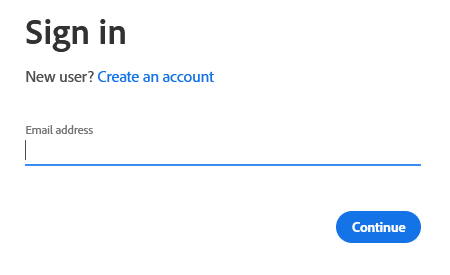

# Insertar un segmento de Adobe Experience Cloud en una lista estática de Marketo {#push-an-adobe-experience-cloud-segment-to-a-marketo-static-list}

Esta función le permite insertar segmentos ubicados en su Adobe Experience Platform en Marketo en forma de lista estática.

>[!PREREQUISITES]
>
>* [Crear un ](/help/marketo/product-docs/administration/users-and-roles/create-an-api-only-user.md) usuario de API en Marketo.
>* A continuación, vaya a **Admin** > **Launchpoint**. Busque el nombre de la función que acaba de crear y haga clic en **Ver detalles**. Copie y guarde la información en **Client ID** y **Client Secret**, ya que la necesitará para esta función.

1. Inicie sesión en [Adobe Experience Platform](https://experience.adobe.com/).

   

1. Haga clic en el icono de cuadrícula y seleccione **Experience Platform**.

   

1. En la navegación de la izquierda, haga clic en **Destinations**.

   

1. Haga clic en **Catálogo**.

   

1. Busque el mosaico del Marketo Engage y haga clic en **Activar**.

   

1. En Tipo de cuenta, haga clic en el botón de opción **New Account**. Introduzca sus credenciales de Marketo y haga clic en **Connect to Destination**.

   

   >[!NOTE]
   >
   >Para encontrar su ID de Munchkin, vaya a **Admin** > **Munchkin** (también forma parte de la URL de Marketo una vez que haya iniciado sesión). Secreto o ID de cliente que debe tener de seguir los requisitos previos de la parte superior de este artículo.

1. &quot;Conectado&quot; debe aparecer debajo de sus credenciales. Haga clic en **Siguiente** en la esquina superior derecha.

   

1. Introduzca un **Name** y una _opcional_ Descripción. Haga clic en **Crear destino**.

   >[!NOTE]
   >
   >La elección de algo de las Acciones de marketing también es opcional. Marketo no aprovecha esa información en este momento, pero es probable que lo haga pronto.

   

1. Haga clic en **Siguiente**.

   

1. Elija el segmento deseado y haga clic en **Siguiente**.

   

   >[!NOTE]
   >
   >Los segmentos a listas estáticas son 1:1. Si elige varios segmentos aquí, tendrá que asignar cada segmento a una lista estática especificada en la pestaña Programación del segmento.

1. Haga clic en **Agregar nueva asignación**.

   

1. Haga clic en el icono del cursor.

   

1. Elija el botón de opción **Seleccionar atributos** o **Seleccionar área de nombres de identidad** (en este ejemplo, elegimos Atributos).

   

   >[!NOTE]
   >
   >Si elige **Seleccionar área de nombres de identidad**, después de realizar la selección, vaya al paso 15.

1. Elija el campo correspondiente que contiene la dirección de correo electrónico que identifica al usuario. Haga clic en **Seleccionar** cuando termine.

   

   

   >[!NOTE]
   >
   >El ejemplo que hemos elegido puede tener un aspecto muy diferente al de su selección.

1. Haga clic en el icono de asignación.

   

1. Elija el campo de objetivo y haga clic en **Seleccionar**.

   

1. Haga clic en **Siguiente**.

   

1. _En Marketo_, cree una lista estática o busque y seleccione una que ya haya creado. Copie el ID de asignación desde el final de la dirección URL.

   

   >[!NOTE]
   >
   >Para obtener los mejores resultados, asegúrese de que la lista a la que hace referencia en Marketo esté vacía.

1. De nuevo en Adobe Experience Platform, introduzca el ID que acaba de copiar. Elija la fecha de inicio. Las personas se sincronizarán continuamente hasta la fecha de finalización elegida. Para una sincronización indefinida, deje la fecha de finalización en blanco. Haga clic en **Siguiente** cuando termine.

   

1. Confirme los cambios y haga clic en **Finish**.

   
