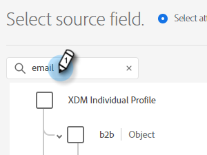

# Insertar un segmento de Adobe Experience Platform en una lista estática de Marketo {#push-an-adobe-experience-platform-segment-to-a-marketo-static-list}

Esta función le permite insertar segmentos ubicados en su Adobe Experience Platform en Marketo en forma de lista estática.

>[!PREREQUISITES]
>
>* [Crear un usuario de API](/help/marketo/product-docs/administration/users-and-roles/create-an-api-only-user.md) en Marketo.
>* A continuación, vaya a **Administrador** > **Punto de inicio**. Busque el nombre de la función que acaba de crear y haga clic en **Ver detalles**. Copie y guarde la información en **ID de cliente** y **Secreto del cliente**, ya que la necesitará para esta función.

1. Iniciar sesión en [Adobe Experience Platform](https://experience.adobe.com/).

   

1. Haga clic en el icono de cuadrícula y seleccione **Experience Platform**.

   

1. En la navegación de la izquierda, haga clic en **Destinos**.

   

1. Haga clic en **Catálogo**.

   

1. Busque el mosaico del Marketo Engage y haga clic en **Activar segmentos**.

   

1. Haga clic en **Configurar nuevo destino**.

1. En Tipo de cuenta, haga clic en la **Nueva cuenta** botón de opción. Introduzca sus credenciales de Marketo y haga clic en **Conectarse al destino**.

   

   >[!NOTE]
   >
   >Puede encontrar su ID de Munchkin yendo a **Administrador** > **Munchkin** (también forma parte de la URL de Marketo una vez que haya iniciado sesión). Secreto o ID de cliente que debe tener de seguir los requisitos previos de la parte superior de este artículo.

1. &quot;Conectado&quot; debe aparecer debajo de sus credenciales. Haga clic en **Siguiente** en la esquina superior derecha.

   

1. Escriba un **Nombre** y _opcional_ Descripción. Haga clic en **Crear destino**.

   >[!NOTE]
   >
   >La elección de algo de las Acciones de marketing también es opcional. Marketo no aprovecha esa información en este momento, pero es probable que lo haga pronto.

   

1. Haga clic en **Siguiente**.

   

1. Elija el segmento deseado y haga clic en **Siguiente**.

   

   >[!NOTE]
   >
   >Si elige varios segmentos aquí, tendrá que asignar cada segmento a una lista estática especificada en la pestaña Programación del segmento.

1. Haga clic en **Añadir nueva asignación**.

   

1. Haga clic en el icono del cursor.

   

1. Elija la **Seleccionar atributos** o **Seleccionar área de nombres de identidad** botón de opción (en este ejemplo, elegimos Atributos).

   

   >[!NOTE]
   >
   >Si elige **Seleccionar área de nombres de identidad**, después de realizar la selección, vaya al paso 15.

1. Elija el campo correspondiente que contiene la dirección de correo electrónico que identifica al usuario. Haga clic en **Select** cuando haya terminado.

   

   

   >[!NOTE]
   >
   >El ejemplo que hemos elegido puede tener un aspecto muy diferente al de su selección.

1. Haga clic en el icono de asignación.

   

1. Choose **Seleccionar área de nombres de identidad**.

   

   >[!IMPORTANT]
   >
   >La asignación de atributos es opcional. Asignación de correo electrónico o ECID desde **Área de nombres de identidad** es lo más importante para garantizar que la persona coincida en Marketo. Asignación de correo electrónico garantizará la mayor tasa de coincidencia.

1. Elija entre ECID o Correo electrónico. En este ejemplo elegimos **Correo electrónico**.

   

1. Haga clic en **Siguiente**.

   

   >[!NOTE]
   >
   >Las identidades se utilizan para buscar coincidencias en Marketo. Si se encuentra una coincidencia, la persona se agrega a la lista estática. Si no se encuentra una coincidencia, esas personas se pierden (es decir, no se crean en Marketo).

1. _En Marketo_, cree una lista estática o busque y seleccione una que ya haya creado. Copie el ID de asignación desde el final de la dirección URL.

   

   >[!NOTE]
   >
   >Para obtener los mejores resultados, asegúrese de que la lista a la que hace referencia en Marketo esté vacía.

1. De nuevo en Adobe Experience Platform, introduzca el ID que acaba de copiar. Elija la fecha de inicio. Las personas se sincronizarán continuamente hasta la fecha de finalización elegida. Para una sincronización indefinida, deje la fecha de finalización en blanco. Haga clic en **Siguiente** cuando haya terminado.

   

1. Confirme los cambios y haga clic en **Finalizar**.

   
