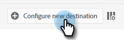

# Insertar un segmento de Adobe Experience Platform en una lista estática de Marketo {#push-an-adobe-experience-platform-segment-to-a-marketo-static-list}

Esta función le permite insertar segmentos ubicados en su Adobe Experience Platform en Marketo en forma de lista estática.

>[!PREREQUISITES]
>
>* [Editar la función de API](/help/marketo/product-docs/administration/users-and-roles/create-delete-edit-and-change-a-user-role.md#edit-an-existing-role) para asegurarse de que tiene la variable **Lectura y escritura** permiso (se encuentra en la lista desplegable API de acceso ).
>* [Crear un usuario de API](/help/marketo/product-docs/administration/users-and-roles/create-an-api-only-user.md) en Marketo.
>* Vaya a **Administrador** > **Punto de inicio**. Busque el nombre de la función que acaba de crear y haga clic en **Ver detalles**. Copie y guarde la información en **ID de cliente** y **Secreto del cliente**, ya que podría necesitarlo para el paso 7.
>* En Marketo, cree una lista estática o busque y seleccione una que ya haya creado. Necesitará su ID.

1. Iniciar sesión en [Adobe Experience Platform](https://experience.adobe.com/).

   

1. Haga clic en el icono de cuadrícula y seleccione **Experience Platform**.

   

1. En la navegación de la izquierda, haga clic en **Destinos**.

   

1. Haga clic en **Catálogo**.

   

1. Busque el mosaico del Marketo Engage y haga clic en **Activar**.

   

1. Haga clic en **Configurar nuevo destino**.

   

1. En Tipo de cuenta, seleccione el botón de opción Cuenta existente o nueva (en este ejemplo, elegimos **Cuenta existente**). Haga clic en el icono Seleccionar cuenta .

   

   >[!NOTE]
   >
   >Si elige Nueva cuenta, puede encontrar su ID de Munchkin en **Administrador** > **Munchkin** (también forma parte de la URL de Marketo una vez que haya iniciado sesión). Secreto o ID de cliente que debe tener de seguir los requisitos previos de la parte superior de este artículo.

1. Seleccione la cuenta de destino y haga clic en **Select**.

   

1. Introducir un destino **Nombre** y una descripción opcional. Haga clic en la lista desplegable Creación de personas y seleccione &quot;Hacer coincidir con personas de Marketo existentes y crear personas que faltan en Marketo&quot; _o_ &quot;Hacer coincidir solo las personas de Marketo existentes&quot; (en este ejemplo elegimos la primera). También debe elegir un **Espacio de trabajo**.

   

   >[!NOTE]
   >
   >Si elige &quot;Coincidir solo con personas de Marketo existentes&quot;, solo deberá asignar el correo electrónico o el ECID, de modo que pueda omitir los pasos 13-16.

1. Esta sección es opcional. Haga clic en **Crear** para omitir.

   

1. Seleccione el destino que ha creado y haga clic en **Siguiente**.

   

1. Elija el segmento que desea enviar a Marketo y haga clic en **Siguiente**.

   

   >[!NOTE]
   >
   >Si elige varios segmentos, tendrá que asignar cada uno de ellos a una lista estática especificada en la ficha Programación del segmento.

   >[!IMPORTANT]
   >
   >Una vez activado un segmento en el destino de Marketo por primera vez, se pueden rellenar los perfiles que ya existían en el segmento antes de la activación de destino de Marketo **hasta 24 horas**. En adelante, cualquier perfil de tiempo que se añada al segmento se añadirá a Marketo inmediatamente.

1. Haga clic en **Añadir nueva asignación**.

   

1. Haga clic en el icono de asignación.

   

1. Elija los atributos que desee y haga clic en **Select**. En este ejemplo, elegimos el nombre, los apellidos y la dirección de correo electrónico.

   

   >[!NOTE]
   >
   >Puede asignar atributos de Experience Platform a cualquiera de los atributos a los que su organización tiene acceso en Marketo Engage. Utilice la variable [Describir solicitud de API](https://developers.marketo.com/rest-api/lead-database/leads/#describe){target=&quot;_blank&quot;} para recuperar los campos de atributos a los que tiene acceso su organización.

1. Asigne los apellidos y el nombre de la empresa haciendo clic en **Añadir nueva asignación** y repita el paso 15 dos veces, eligiendo **lastName** y luego **companyName**.

   

1. Ahora es el momento de asignar la dirección de correo electrónico. Haga clic en **Añadir nueva asignación** de nuevo.

   

1. Haga clic en el icono de asignación.

   

1. Haga clic en el botón de opción Seleccionar área de nombres de identidad y seleccione  **Correo electrónico** y haga clic en **Select**.

   

   >[!IMPORTANT]
   >
   >Asignación de correo electrónico o ECID desde **Área de nombres de identidad** es lo más importante para garantizar que la persona coincida en Marketo. Asignación de correo electrónico garantizará la mayor tasa de coincidencia.

1. Ahora es el momento de elegir los campos de origen. Para correo electrónico, haga clic en el icono del cursor.

   

1. Haga clic en el botón de opción Seleccionar área de nombres de identidad , busque y seleccione **Correo electrónico** y haga clic en **Select**.

   

1. Para elegir el campo de origen Nombre de la empresa , haga clic en el icono del cursor en su fila.

   

1. Deje activado el botón de opción Seleccionar atributos . Busque &quot;empresa&quot; y seleccione **companyName** y haga clic en **Select**.

   

1. Asigne los campos de origen a Apellidos y Nombre haciendo clic en el icono de cursor para cada paso y repitiendo el paso 23 dos veces, eligiendo **lastName** y luego **firstName**.

   

1. Haga clic en **Siguiente**.

   

1. Revise los cambios y haga clic en **Finalizar**.

   
