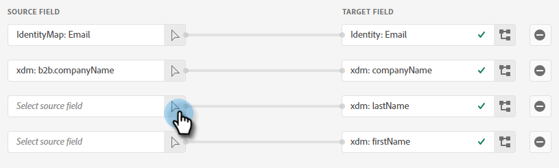

# Clonar push {#push-clone}

Esta función le permite insertar segmentos ubicados en su Adobe Experience Platform en Marketo en forma de lista estática.

>[!PREREQUISITES]
>
>* [Crear un usuario de API](/help/marketo/product-docs/administration/users-and-roles/create-an-api-only-user.md) en Marketo.
>* A continuación, vaya a **Administrador** > **Punto de inicio**. Busque el nombre de la función que acaba de crear y haga clic en **Ver detalles**. Copie y guarde la información en **ID de cliente** y **Secreto del cliente**, ya que la necesitará para esta función.
>* En Marketo, cree una lista estática o busque y seleccione una que ya haya creado. Necesitará su ID.

1. Iniciar sesión en [Adobe Experience Platform](https://experience.adobe.com/).

   

1. Haga clic en el icono de cuadrícula y seleccione **Experience Platform**.

   

1. En la navegación de la izquierda, haga clic en **Destinos**.

   

1. Haga clic en **Catálogo**.

   

1. Busque el mosaico del Marketo Engage y haga clic en **Activar segmentos**.

   

1. Haga clic en **Configurar nuevo destino**.

   

1. En Tipo de cuenta, seleccione el botón de opción Cuenta existente o nueva (en este ejemplo, elegimos **Cuenta existente**). Haga clic en el icono Seleccionar cuenta .

   

1. Seleccione la cuenta de destino y haga clic en **Select**.

   

1. Introducir un destino **Nombre** y una descripción opcional. Haga clic en la lista desplegable Creación de personas y seleccione &quot;Hacer coincidir con personas de Marketo existentes y crear personas que faltan en Marketo&quot; _o_ &quot;Hacer coincidir solo los usuarios de Marketo existentes&quot;. En este ejemplo elegimos el primero.

   

   >[!NOTE]
   >
   >Si elige &quot;Coincidir solo con personas de Marketo existentes&quot;, solo deberá asignar el correo electrónico o el ECID, de modo que pueda omitir los pasos 13-16.

1. Esta sección es opcional. Haga clic en **Crear** para omitir.

   

1. Seleccione el destino que ha creado y haga clic en **Siguiente**.

   

1. Elija el segmento que desea enviar a Marketo y haga clic en **Siguiente**.

   

1. Haga clic en **Añadir nueva asignación**.

   

1. Haga clic en el icono de asignación.

   

1. Asignar nombre seleccionando **firstName** y haga clic en **Select**.

   

1. Asigne los apellidos y el nombre de la empresa haciendo clic en **Añadir nueva asignación** y repita el paso 15 dos veces, eligiendo **lastName** y luego **companyName**.

   

1. Ahora es el momento de asignar la dirección de correo electrónico. Haga clic en **Añadir nueva asignación** de nuevo.

   

1. Haga clic en el icono de asignación.

   

1. Haga clic en el botón de opción Seleccionar área de nombres de identidad y seleccione  **Correo electrónico** y haga clic en **Select**.

   

1. Ahora es el momento de elegir los campos de origen. Para correo electrónico, haga clic en el icono del cursor.

   

1. Haga clic en el botón de opción Seleccionar área de nombres de identidad , busque y seleccione **Correo electrónico** y haga clic en **Select**.

   

1. Para elegir el campo de origen Nombre de la empresa , haga clic en el icono del cursor en su fila.

   

1. Deje activado el botón de opción Seleccionar atributo . Busque &quot;empresa&quot; y seleccione **companyName** y haga clic en **Select**.

   

1. Asigne los campos de origen a Apellidos y Nombre haciendo clic en el icono de cursor para cada paso y repitiendo el paso 23 dos veces, eligiendo **lastName** y luego **firstName**.

   

1. Haga clic en **Siguiente**.

   

1. Ahora necesitará el ID de su lista. Haga clic en la pestaña del explorador que tiene abierta la lista estática de Marketo (o abra una nueva pestaña y seleccione la lista estática deseada).

   

1. Resalte y copie el ID de lista al final de la dirección URL.

   

1. Pegue el ID que acaba de copiar en ID de asignación y haga clic en **Siguiente**.

   

1. Haga clic en **Finalizar**.

   
