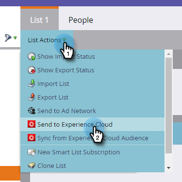

# Enviar una lista a Adobe Experience Cloud {#send-a-list-to-adobe-experience-cloud}

>[!NOTE]
>
>Una implementación lista para HIPAA de una instancia de Marketo no puede utilizar esta función.

>[!PREREQUISITES]
>
>[Configuración del uso compartido de audiencias de Adobe Experience Cloud](/help/marketo/product-docs/core-marketo-concepts/miscellaneous/set-up-adobe-experience-cloud-audience-sharing.md)

## Aplicaciones de destino compatibles {#supported-destination-applications}

* Adobe Advertising Cloud
* Adobe Analytics (**only** si posee una licencia de Adobe Audience Manager)
* Adobe Audience Manager
* Adobe Experience Manager
* Adobe Real-time Customer Data Platform
* Adobe Target

## Cómo enviar una lista estática {#how-to-send-a-static-list}

Una lista estática es simplemente eso, estática. No se producirán cambios en la lista en Adobe Experience Cloud a menos que los realice manualmente.

1. En Marketo, busque la lista que desee exportar. Haga clic con el botón derecho en ella y seleccione **Enviar al Experience Cloud**.

   

1. Haga clic en el **Carpeta del Audience Manager** y seleccione la carpeta de destino que desee en el Experience Cloud .

   

1. Elija si desea crear una audiencia nueva o sobrescribir una existente (en este ejemplo estamos creando una nueva). Introduzca el nuevo nombre de audiencia y haga clic en **Enviar**.

   

1. Haga clic en **OK**.

   

   >[!NOTE]
   >
   >La pertenencia a la audiencia puede tardar hasta 6-8 horas en completarse en el Adobe.

## Cómo enviar una lista sincronizada {#how-to-send-a-synced-list}

La sincronización de una lista significa que, cada vez que actualice una lista en Marketo, esta se sincroniza automáticamente con su audiencia en Adobe Experience Cloud.

1. En Marketo, busque la lista que desee exportar. Haga clic con el botón derecho en ella y seleccione **Enviar al Experience Cloud**.

   

1. Haga clic en el **Carpeta de la biblioteca de audiencias** y seleccione la carpeta de destino que desee en el Experience Cloud .

   

1. Elija si desea crear una audiencia nueva o sobrescribir una existente (en este ejemplo estamos creando una nueva). Introduzca el nuevo nombre de audiencia y marque la casilla **Mantener la pertenencia a la audiencia sincronizada** y haga clic en **Enviar**.

   

1. Haga clic en **OK**.

   

## Detener una sincronización de lista {#how-to-stop-a-list-sync}

Puede impedir que la lista se sincronice en cualquier momento.

1. En Marketo, busque y haga clic con el botón derecho en la lista que desee detener la sincronización. Haga clic en **Detener sincronización de lista**.

   

1. Seleccione las audiencias que desea que dejen de sincronizarse y haga clic en **Stop**.

   

1. Haga clic en **Stop** para confirmar.

   

## Aspectos a tener en cuenta {#things-to-note}

**Uso compartido con Adobe Analytics**

Para los clientes propietarios tanto de Adobe Audience Manager como de Adobe Analytics, esta integración permitirá compartir audiencias desde Marketo con sus grupos de informes de Adobe Analytics. Sin embargo, hay que realizar algunos pasos adicionales de configuración en Adobe Audience Manager para habilitarlos. Consulte la documentación de Adobe Audience Manager para obtener más información sobre cómo configurarla: [https://experienceleague.adobe.com/docs/analytics/integration/audience-analytics/mc-audiences-aam.html](https://experienceleague.adobe.com/docs/analytics/integration/audience-analytics/mc-audiences-aam.html).

**Uso de características para clientes de Adobe Audience Manager**

Al iniciar una exportación de lista en Marketo, verá los siguientes cambios reflejados en la instancia de Adobe Audience Manager:

* Para todos los posibles clientes de la lista exportada, Marketo escribirá un rasgo utilizando los correos electrónicos con hash de los posibles clientes como identificador entre dispositivos. El nombre del rasgo coincidirá con el nombre de audiencia de destino especificado durante la exportación.
* Para todos los ECID que Marketo ha logrado coincidir con los posibles clientes de la lista exportada, Marketo escribirá un rasgo utilizando el identificador de dispositivo ECID. El nombre del rasgo coincidirá con el nombre de audiencia de destino especificado durante la exportación.
* Marketo también creará un segmento en la instancia de Audience Manager utilizando el rasgo ECID como único criterio de segmentación. El nombre del segmento coincidirá con el nombre de audiencia de destino especificado durante la exportación.

## Preguntas frecuentes {#faq}

**¿Por qué el tamaño de la lista en Marketo es diferente del de la lista en Adobe?**

En el capó, la integración de audiencias funciona sincronizando las cookies de Marketo Munchkin con la cookie ECID de Adobe correspondiente. Marketo solo puede compartir datos de pertenencia para posibles clientes para los que Marketo haya sincronizado un ECID. Para obtener los mejores resultados posibles, se recomienda cargar el script de seguimiento munchkin.js de Marketo en paralelo con el código de seguimiento visitor.js de Adobe en todas las páginas que le interesen rastrear con fines de marketing.

**¿Cómo funciona la sincronización de cookies?**

Cuando la sincronización de cookies esté habilitada para su suscripción a Marketo, munchkin.js de Marketo intentará capturar y almacenar los ECID de Adobe para la organización de IMS de Adobe que especificó durante la configuración de la integración y hacer coincidir estos ECID con el identificador de cookie de Marketo correspondiente. Esto permite que los perfiles de usuario anónimos de Marketo se enriquezcan con los ECID de Adobe.

Se requiere un paso más para asociar el perfil de usuario anónimo a un perfil de posible cliente, que se identifica mediante un correo electrónico de texto sin formato. Exactamente cómo funciona esto [aquí](/help/marketo/product-docs/reporting/basic-reporting/report-activity/tracking-anonymous-activity-and-people.md).

**¿Qué información se comparte?**

Esta integración solo comparte información de pertenencia a listas de Marketo con Adobe (por ejemplo, el conocimiento de que Lead X es miembro de List Y). No se comparten en Adobe atributos de posible cliente adicionales mediante esta integración.
