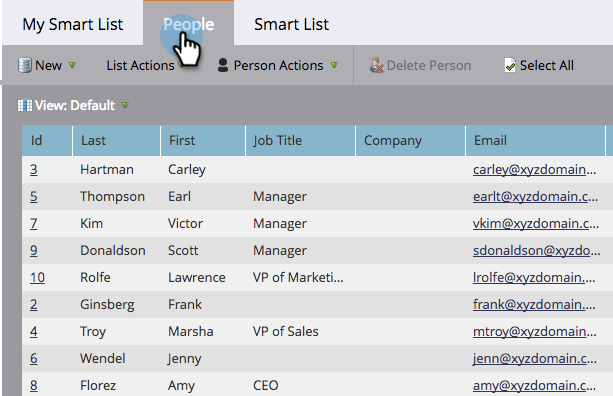

# Explicación de las listas inteligentes {#understanding-smart-lists}

Las listas inteligentes permiten encontrar grupos específicos de personas mediante filtros simples. Se utilizan en todo Marketo, como en campañas inteligentes, programas, informes, segmentaciones, modelos de negocio, programas de participación, contenido dinámico, etc. Según sus necesidades, las listas inteligentes se pueden crear en dos lugares dentro de Marketo:

1. En la **Base de datos**, donde están disponibles para uso compartido/global (por ejemplo, &quot;Todas las personas que han dejado de suscribirse&quot;).
1. En **programas** como recursos locales, donde encuentran un grupo de personas que son relevantes para ese programa específico (por ejemplo, &quot;Programa comercial asistido&quot;).

Los pasos principales para crear una lista inteligente son:

1. [Crear una lista inteligente](/help/marketo/product-docs/core-marketo-concepts/smart-lists-and-static-lists/creating-a-smart-list/create-a-smart-list.md)
1. [Buscar y agregar filtros a una lista inteligente](/help/marketo/product-docs/core-marketo-concepts/smart-lists-and-static-lists/creating-a-smart-list/find-and-add-filters-to-a-smart-list.md)
1. [Definir filtros de lista inteligente](/help/marketo/product-docs/core-marketo-concepts/smart-lists-and-static-lists/creating-a-smart-list/define-smart-list-filters.md)

Este es un ejemplo de cómo se ve una lista inteligente.

## Pestaña principal {#main-tab}

Aquí puede [editar el nombre de la lista inteligente](/help/marketo/product-docs/core-marketo-concepts/miscellaneous/rename-a-marketo-asset.md) y ver información sobre la lista inteligente.

## Pestaña Personas {#people-tab}

Aquí es donde se ven los resultados; es decir, todas las personas que cumplen los requisitos para los filtros que [agregó y definió](/help/marketo/product-docs/core-marketo-concepts/smart-lists-and-static-lists/creating-a-smart-list/find-and-add-filters-to-a-smart-list.md) en la ficha Lista inteligente.

## Ficha Lista inteligente {#smart-list-tab}

Puede añadir y definir los filtros para ver un grupo específico de personas en la pestaña Personas .

¡Bien, empecemos!

>[!MORELIKETHIS]
>
>* [Usar listas inteligentes integradas/del sistema](/help/marketo/product-docs/core-marketo-concepts/smart-lists-and-static-lists/using-smart-lists/use-built-in-system-smart-lists.md)
>* [Crear una lista inteligente](/help/marketo/product-docs/core-marketo-concepts/smart-lists-and-static-lists/creating-a-smart-list/create-a-smart-list.md)

