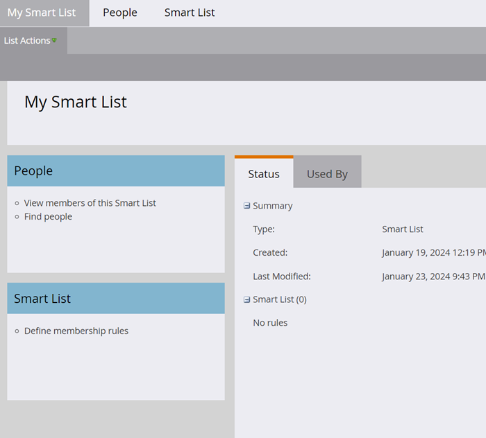

# Explicación de las listas inteligentes {#understanding-smart-lists}

Las listas inteligentes permiten encontrar grupos específicos de personas mediante filtros simples. Se utilizan en todo Marketo, como en campañas inteligentes, programas, informes, segmentaciones, modelos empresariales, programas de participación, contenido dinámico y mucho más. Según sus necesidades, las listas inteligentes se pueden crear en dos lugares dentro de Marketo:

1. En la **base de datos**, donde están disponibles para uso compartido o global (por ejemplo, &quot;Todas las personas sin suscribir&quot;).
1. En **programas** como recursos locales, donde encuentran un grupo de personas que son relevantes para ese programa específico (por ejemplo, &quot;Ferias a las que asistió&quot;).

Los pasos principales para crear una lista inteligente son los siguientes:

1. [Crear una lista inteligente](/help/marketo/product-docs/core-marketo-concepts/smart-lists-and-static-lists/creating-a-smart-list/create-a-smart-list.md){target="_blank"}
1. [Buscar y añadir filtros a una lista inteligente](/help/marketo/product-docs/core-marketo-concepts/smart-lists-and-static-lists/creating-a-smart-list/find-and-add-filters-to-a-smart-list.md){target="_blank"}
1. [Definir filtros de la lista inteligente](/help/marketo/product-docs/core-marketo-concepts/smart-lists-and-static-lists/creating-a-smart-list/define-smart-list-filters.md){target="_blank"}

A continuación se muestra un ejemplo del aspecto de una lista inteligente.

## Pestaña Principal {#main-tab}

Aquí puede [editar el nombre de la lista inteligente](/help/marketo/product-docs/core-marketo-concepts/miscellaneous/rename-a-marketo-asset.md){target="_blank"} y ver información sobre la lista inteligente.

## Pestaña Personas {#people-tab}

Aquí es donde ve los resultados; es decir, todas las personas que cumplen los requisitos para los filtros que [agregó y definió](/help/marketo/product-docs/core-marketo-concepts/smart-lists-and-static-lists/creating-a-smart-list/find-and-add-filters-to-a-smart-list.md){target="_blank"} en la ficha Lista inteligente.

## Ficha de lista inteligente {#smart-list-tab}

Agregue y defina los filtros para ver un grupo específico de personas en la ficha [!UICONTROL Personas].

>[!MORELIKETHIS]
>
>* [Usar listas inteligentes integradas o del sistema](/help/marketo/product-docs/core-marketo-concepts/smart-lists-and-static-lists/using-smart-lists/use-built-in-system-smart-lists.md){target="_blank"}
>* [Crear una lista inteligente](/help/marketo/product-docs/core-marketo-concepts/smart-lists-and-static-lists/creating-a-smart-list/create-a-smart-list.md){target="_blank"}
