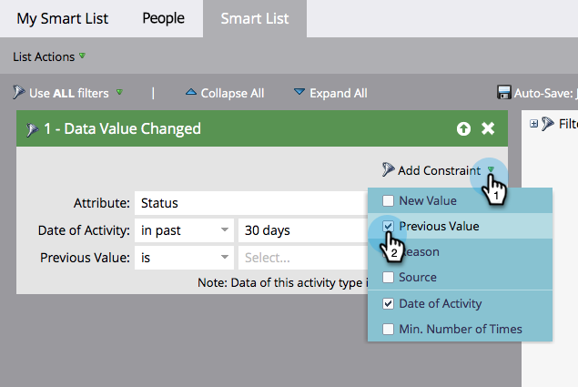

# Agregar una restricción a un filtro de listas inteligentes {#add-a-constraint-to-a-smart-list-filter}

Al crear una lista inteligente, algunos filtros tienen opciones avanzadas denominadas &quot;restricciones&quot;. Estas son condiciones adicionales que puede agregar a los filtros y déclencheur para ayudar a limitar la búsqueda aún más.

En este ejemplo, vamos a agregar algunas restricciones a un filtro de **[Valor de datos cambiado](/help/marketo/product-docs/core-marketo-concepts/smart-campaigns/flow-actions/change-data-value.md){target="_blank"}** para encontrar personas que tuvieron un cambio de estado de MQL a SQL.

>[!PREREQUISITES]
>
>* [Crear una lista inteligente](/help/marketo/product-docs/core-marketo-concepts/smart-lists-and-static-lists/creating-a-smart-list/create-a-smart-list.md){target="_blank"}
>* [Usar el filtro &quot;Valor de datos cambiado&quot; en una lista inteligente](/help/marketo/product-docs/core-marketo-concepts/smart-lists-and-static-lists/using-smart-lists/use-the-data-value-changed-filter-in-a-smart-list.md){target="_blank"}

1. Vaya a **[!UICONTROL Actividades de marketing]**.

   

1. Seleccione la Smart List con un filtro al que agregará una restricción y haga clic en la ficha **[!UICONTROL Smart List]**.

   

1. En **[!UICONTROL Agregar restricción]**, seleccione **[!UICONTROL Valor anterior]**.

   

1. Escriba el **[!UICONTROL Valor anterior]**. En este ejemplo, utilizamos MQL.

   

1. En **[!UICONTROL Agregar restricción]**, seleccione **[!UICONTROL Nuevo valor]**.

   

1. Introduzca el nuevo valor. En este ejemplo, se utiliza SQL.

   

1. ¡Bien hecho! Haga clic en la ficha **[!UICONTROL Personas]** para ver todas las personas que han cambiado de estado de &quot;MQL&quot; a &quot;SQL&quot; en los últimos 30 días.
