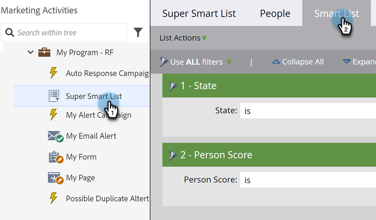
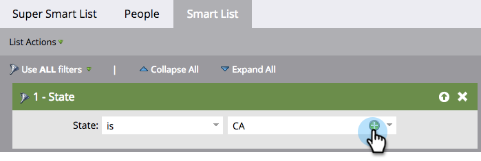

# Añadir varios valores a un filtro de listas inteligentes {#add-multiple-values-to-a-smart-list-filter}

>[!PREREQUISITES]
>
>* [Crear una lista inteligente](/help/marketo/product-docs/core-marketo-concepts/smart-lists-and-static-lists/creating-a-smart-list/create-a-smart-list.md){target="_blank"}
>* [Buscar y agregar filtros a una lista inteligente](/help/marketo/product-docs/core-marketo-concepts/smart-lists-and-static-lists/creating-a-smart-list/find-and-add-filters-to-a-smart-list.md){target="_blank"}

Supongamos que desea encontrar a todos los usuarios en California, pero es posible que almacene tanto &quot;California&quot; como &quot;CA&quot; en la base de datos. Para incluir a todas las personas aplicables, podría usar dos filtros [!UICONTROL Estado], pero es más fácil con uno.

1. Vaya a **[!UICONTROL Actividades de marketing]**.

   

1. Busque y seleccione una lista inteligente y haga clic en la ficha **[!UICONTROL Lista inteligente]**.

   

1. Haga clic en **+** en el filtro.

   

1. Puede elegir valores de la izquierda o escribirlos a la derecha y luego hacer clic en **[!UICONTROL Aceptar]**.

   

>[!MORELIKETHIS]
>
>* [Agregar una restricción a un filtro de listas inteligentes](/help/marketo/product-docs/core-marketo-concepts/smart-lists-and-static-lists/using-smart-lists/add-a-constraint-to-a-smart-list-filter.md){target="_blank"}
>* [Usar filtros avanzados en una lista inteligente](/help/marketo/product-docs/core-marketo-concepts/smart-lists-and-static-lists/using-smart-lists/using-advanced-smart-list-rule-logic.md){target="_blank"}
