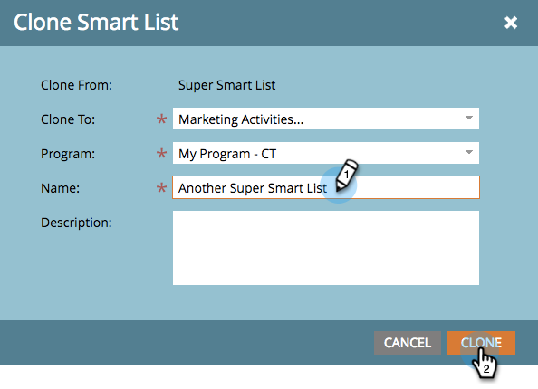

# Clonar una lista o lista inteligente {#clone-a-list-or-smart-list}

En lugar de crear una lista inteligente desde cero, ahorre tiempo clonando una similar y realizando cambios.

1. Vaya a **[!UICONTROL Actividades de marketing]**.

   

1. Seleccione la lista inteligente que desea clonar. En **[!UICONTROL Acciones de lista]**, haga clic en **[!UICONTROL Clonar lista inteligente]**.

   

1. Escriba un **[!UICONTROL Nombre]** y haga clic en **[!UICONTROL Clonar]**.

   

También puede clonar listas regulares de la misma manera.
