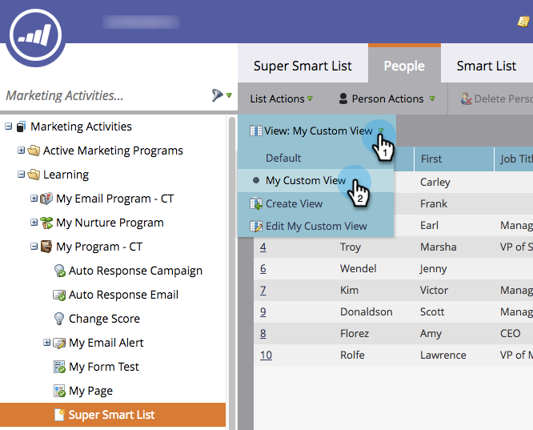
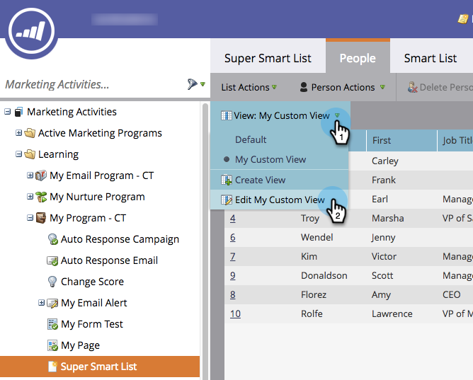

# Crear y cambiar vistas para listas y listas inteligentes {#create-and-change-views-for-lists-and-smart-list}

Una lista inteligente muestra un conjunto predeterminado de columnas. ¿Sabía que podría editar esas columnas en el contenido de su corazón? Así es como.

## Crear una vista {#create-a-view}

1. Vaya a una lista o lista inteligente, haga clic en la pestaña **People** y haga clic en **Create** **View** en la lista desplegable **View**.

   

1. Asigne un nombre a la vista y busque la columna que desee agregar o eliminar.

   

1. Agregue o elimine las columnas que desee y haga clic en **Crear**.

   

>[!TIP]
>
>Para buscar rápidamente, utilice el cuadro **Find**.

## Vistas de conmutador {#switch-views}

1. Haga clic en la lista desplegable **View** y, a continuación, seleccione la vista que desee. Cambie de vista si es necesario.

   

>[!NOTE]
>
> Primero debe crear una segunda vista, además de la vista predeterminada, para cambiar de vista.

## Editar una vista {#edit-a-view}

1. Asegúrese de que la vista que desea editar esté seleccionada en la lista desplegable **View**.

   

1. Haga clic en la opción **Edit**.

   

1. Realice los cambios que desee y haga clic en **Guardar**.

   

## Eliminar una vista {#delete-a-view}

1. Seleccione la opción **Editar** para la vista que desee eliminar de la lista desplegable **Ver**.

   

1. Haga clic en **Eliminar**.

   

Solo usted puede ver las vistas personalizadas que crea en la lista desplegable Ver, así que dígale a sus amigos que necesitan crear las suyas!

>[!MORELIKETHIS]
>
>* [Usar listas inteligentes integradas/del sistema](/help/marketo/product-docs/core-marketo-concepts/smart-lists-and-static-lists/using-smart-lists/use-built-in-system-smart-lists.md)
>* [Crear una lista inteligente](/help/marketo/product-docs/core-marketo-concepts/smart-lists-and-static-lists/creating-a-smart-list/create-a-smart-list.md)

