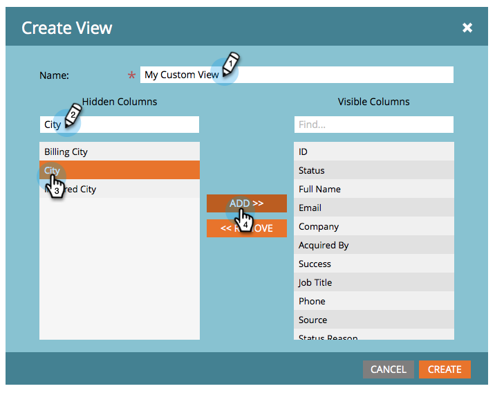
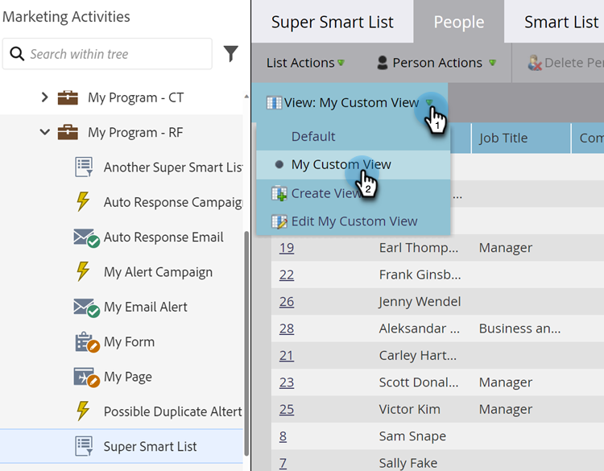
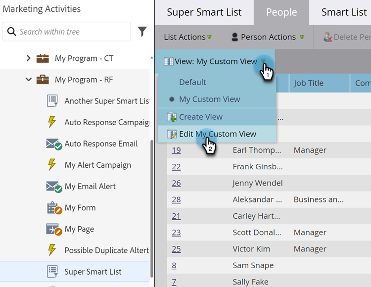

# Crear y cambiar vistas para listas y listas inteligentes {#create-and-change-views-for-lists-and-smart-list}

Una lista inteligente muestra un conjunto predeterminado de columnas. Estas columnas se pueden personalizar.

## Crear una vista {#create-a-view}

1. Vaya a una lista o lista inteligente, haga clic en la ficha **[!UICONTROL Personas]** y, a continuación, haga clic en **[!UICONTROL Crear vista]** en la lista desplegable **[!UICONTROL Vista]**.

   

1. Asigne un nombre a la vista y busque la columna que desee añadir o quitar.

   

1. Agregue o quite las columnas que desee y después haga clic en **[!UICONTROL Crear]**.

   

>[!TIP]
>
>Para buscar rápidamente, usa el cuadro **[!UICONTROL Buscar]**.

## Cambiar vistas {#switch-views}

1. Haga clic en la lista desplegable **[!UICONTROL Vista]** y, a continuación, seleccione la vista que desee. Cambie de una vista a otra según sea necesario.

   

>[!NOTE]
>
> Primero debe crear una segunda vista, además de la vista predeterminada, para cambiar de vista.

## Editar una vista {#edit-a-view}

1. Compruebe que la vista que desea editar esté seleccionada en la lista desplegable **[!UICONTROL Vista]**.

   

1. Haga clic en la opción **[!UICONTROL Editar]**.

   

1. Realice los cambios que desee y haga clic en **[!UICONTROL Guardar]**.

   

## Eliminar una vista {#delete-a-view}

1. Seleccione la opción **[!UICONTROL Editar]** para la vista que desee eliminar de la lista desplegable **[!UICONTROL Vista]**.

   

1. Haga clic en **[!UICONTROL Eliminar]**.

   

Solo usted puede ver las vistas personalizadas que crea en la lista desplegable Vista, así que dígale a sus amigos que necesitan crear las suyas propias.

>[!MORELIKETHIS]
>
>* [Usar listas inteligentes integradas o del sistema](/help/marketo/product-docs/core-marketo-concepts/smart-lists-and-static-lists/using-smart-lists/use-built-in-system-smart-lists.md){target="_blank"}
>* [Crear una lista inteligente](/help/marketo/product-docs/core-marketo-concepts/smart-lists-and-static-lists/creating-a-smart-list/create-a-smart-list.md){target="_blank"}
