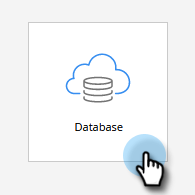
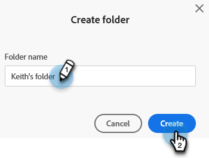

# Hacer referencia a una lista o lista inteligente en espacios de trabajo {#reference-a-list-or-smart-list-across-workspaces}

Las listas y las listas inteligentes se pueden compartir y se puede hacer referencia a ellas en espacios de trabajo para facilitar su reutilización desde la base de datos.

>[!NOTE]
>
>Se aplican reglas de partición de persona (las listas inteligentes y las listas estáticas de un área de trabajo solo muestran a las personas que son miembros de la lista _y_ miembros del área de trabajo actual).

## Compartir una lista o lista inteligente {#share-a-list-or-smart-list}

1. Ir a **[!UICONTROL Base de datos]**.

   

1. Haga clic con el botón derecho en una carpeta de campaña. Seleccione **[!UICONTROL Nueva carpeta]**.

   

   >[!NOTE]
   >
   >Assets solo se puede compartir entre espacios de trabajo si están anidados en una carpeta.

1. Asigne un nombre a la carpeta y haga clic en **[!UICONTROL Crear]**.

   

1. Arrastre y suelte una lista o lista inteligente que desee compartir en la nueva carpeta.

   

1. Haga clic con el botón derecho en la nueva carpeta y seleccione **[!UICONTROL Compartir carpeta]**.

   

1. Elige una **[!UICONTROL Workspace]** con la que compartir y haz clic en **[!UICONTROL Guardar]**.

   

   ¡Fantástico! Esta lista ahora estará disponible en ambos espacios de trabajo.

   >[!NOTE]
   >
   >En las actividades de marketing, solo puede compartir carpetas de nivel superior. En la base de datos, puede compartir carpetas de nivel superior y de un nivel inferior.
