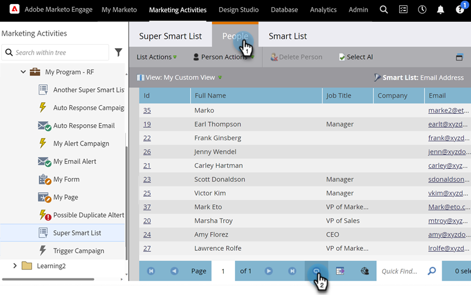
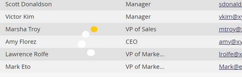

# Actualizar una lista o lista inteligente {#refresh-a-list-or-smart-list}

Si ha ejecutado una lista inteligente y han transcurrido unos minutos, los resultados podrían ser diferentes ahora: actualice para averiguarlo.

## Actualizar resultados {#refresh-results}

1. Para actualizar datos en la ficha **[!UICONTROL Personas]** de una lista inteligente, haga clic en el icono de actualización.

   

1. La Smart List se vuelve a ejecutar y muestra un conjunto de resultados más actualizado.

   

>[!TIP]
>
>A veces, cuando ejecuta una lista inteligente y vuelve más tarde, puede que vea la palabra &quot;Acerca de&quot; delante del recuento de personas en la esquina inferior derecha. Esto indica que el número es aproximado: haga clic en el propio recuento para actualizarlo y obtener un recuento actualizado y preciso.

>[!MORELIKETHIS]
>
>[Exportar personas a Excel desde una lista o lista inteligente](/help/marketo/product-docs/core-marketo-concepts/smart-lists-and-static-lists/managing-people-in-smart-lists/export-people-to-excel-from-a-list-or-smart-list.md){target="_blank"}
