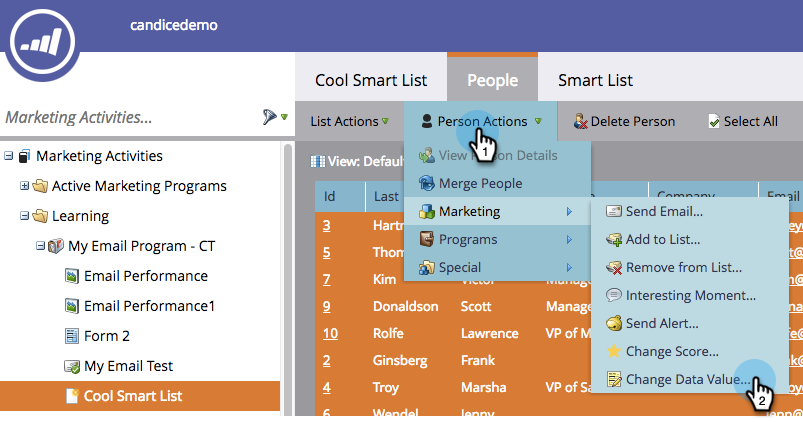
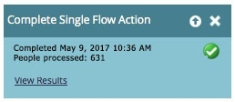

# Ejecutar un solo paso de flujo desde una lista inteligente {#run-a-single-flow-step-from-a-smart-list}

Si desea ejecutar un paso de flujo único, puede utilizar un solo paso de flujo dentro de una lista inteligente en lugar de crear una campaña inteligente completa.

>[!PREREQUISITES]
>
>[Crear una lista inteligente](/help/marketo/product-docs/core-marketo-concepts/smart-lists-and-static-lists/creating-a-smart-list/create-a-smart-list.md)

1. Vaya a **Marketing Activities**.

   

1. Seleccione una lista o lista inteligente con personas incluidas y vaya a la pestaña **People**.

   

   >[!TIP]
   >
   >Tanto las listas estáticas como las listas inteligentes tienen esta funcionalidad.

1. Haga clic en **Seleccionar todo**. También puede utilizar **Ctrl/Cmd** y hacer clic para seleccionar algunos registros manualmente.

   

   >[!NOTE]
   >
   >Si los resultados abarcan varias páginas, al hacer clic en **Seleccionar todo** se seleccionarán todas las personas de todas las páginas.

1. En **Persona** **Actions**, seleccione el paso de flujo que desee. En este ejemplo utilizaremos [Cambiar valor de datos](/help/marketo/product-docs/core-marketo-concepts/smart-campaigns/flow-actions/change-data-value.md).

   

1. Busque y seleccione un **Attribute**. En este ejemplo tomaremos todas las personas que tengan el estado &quot;California&quot; y lo cambiaremos a &quot;CA&quot;.

   

1. Introduzca un nuevo valor. Haga clic en **Ejecutar ahora**.

   

1. Si está cambiando los valores de los datos de un gran número de personas, es posible que tenga que confirmar el cambio escribiendo el número. Haga clic en **Ir por él**.

   

¡Increíble trabajo! Verá el estado del paso de flujo único en la esquina superior derecha.

Cuando termine, actualice la lista y verá la información actualizada.
