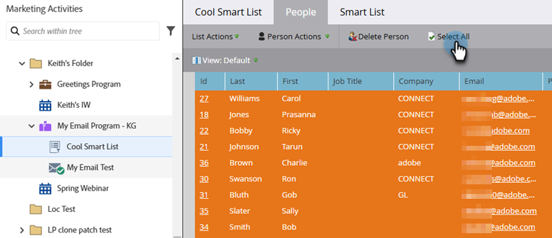

# Ejecutar un solo paso de flujo desde una lista inteligente {#run-a-single-flow-step-from-a-smart-list}

Si desea ejecutar un paso de flujo de solo una vez, puede utilizar un solo paso de flujo dentro de una Smart List en lugar de crear una campaña inteligente completa.

>[!PREREQUISITES]
>
>[Crear una lista inteligente](/help/marketo/product-docs/core-marketo-concepts/smart-lists-and-static-lists/creating-a-smart-list/create-a-smart-list.md){target="_blank"}

1. Vaya a **[!UICONTROL Actividades de marketing]**.

   

1. Seleccione una lista o lista inteligente con personas y, a continuación, vaya a la ficha **[!UICONTROL Personas]**.

   

   >[!TIP]
   >
   >Tanto las listas estáticas como las listas inteligentes tienen esta funcionalidad.

1. Haga clic en **[!UICONTROL Seleccionar todo]**. También puede usar **Ctrl/Cmd** y hacer clic para seleccionar algunos registros manualmente.

   

   >[!NOTE]
   >
   >Si los resultados abarcan varias páginas, al hacer clic en **[!UICONTROL Seleccionar todo]** se seleccionarán todas las personas en todas las páginas.

1. En **[!UICONTROL Acciones de persona]**, seleccione el paso de flujo que desee. En este ejemplo utilizaremos [Cambiar valor de datos](/help/marketo/product-docs/core-marketo-concepts/smart-campaigns/flow-actions/change-data-value.md){target="_blank"}.

   

1. Busque y seleccione un **[!UICONTROL atributo]**. En este ejemplo, tomaremos todas las personas que tengan el estado &quot;California&quot; y lo cambiaremos a &quot;CA&quot;.

   

1. Introduzca un nuevo valor. Haga clic en **[!UICONTROL Ejecutar ahora]**.

   

1. Si va a cambiar los valores de los datos de un gran número de personas, es posible que tenga que confirmar el cambio escribiendo el número. Haga Clic En **[!UICONTROL Ir A Por Él]**.

   

¡Increíble trabajo! Verá el estado del paso de un solo flujo en la esquina superior derecha.

Cuando haya terminado, actualice la lista y verá la información actualizada.
