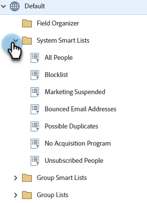

# Usar listas inteligentes integradas/del sistema {#use-built-in-system-smart-lists}

El Marketo Engage tiene algunas listas inteligentes integradas muy útiles. ¡Vamos a echarles un vistazo!

1. Ir a **[!UICONTROL Base de datos]**.

   

1. Abra la carpeta **[!UICONTROL Listas inteligentes del sistema]** para mostrar la colección.

   

1. Para ver un ejemplo: Seleccione **[!UICONTROL Todas las personas]** y luego haga clic en la ficha **[!UICONTROL Personas]**.

   

   >[!NOTE]
   >
   >No es necesario aplicar los filtros de las listas inteligentes del sistema a cada lista inteligente o campaña. Su contenido se reconoce automáticamente.

Este es un resumen de lo que hacen las listas inteligentes integradas:

<table><thead>
  <tr>
    <th>Nombre de la lista</th>
    <th>Descripción</th>
  </tr></thead>
<tbody>
  <tr>
    <td>Todas las personas</td>
    <td>Todas las personas de la base de datos de Marketo</td>
  </tr>
  <tr>
    <td>Personas que cancelaron su suscripción</td>
    <td>A estas personas solo se les pueden enviar correos electrónicos operativos; esto generalmente lo controla la propia persona.</td>
  </tr>
  <tr>
    <td>Marketing suspendido</td>
    <td>Estas personas solo pueden recibir correos electrónicos operativos; normalmente, usted, el experto en marketing, lo controla.</td>
  </tr>
  <tr>
    <td>Lista de bloqueos</td>
    <td>Estas personas no recibirán ningún correo electrónico.</td>
  </tr>
  <tr>
    <td>Direcciones de email rechazadas</td>
    <td>Personas con una dirección de correo electrónico que no se puede enviar o que rechazan el correo electrónico.</td>
  </tr>
  <tr>
    <td>Duplicados posibles</td>
    <td>Personas que podrían estar duplicadas en la base de datos de Marketo.</td>
  </tr>
</tbody>
</table>

>[!NOTE]
>
>No se pueden eliminar las listas inteligentes del sistema. Con la excepción de la lista Duplicados posibles, tampoco se pueden editar.

>[!MORELIKETHIS]
>
>[Crear una lista inteligente](/help/marketo/product-docs/core-marketo-concepts/smart-lists-and-static-lists/creating-a-smart-list/create-a-smart-list.md){target="_blank"}
