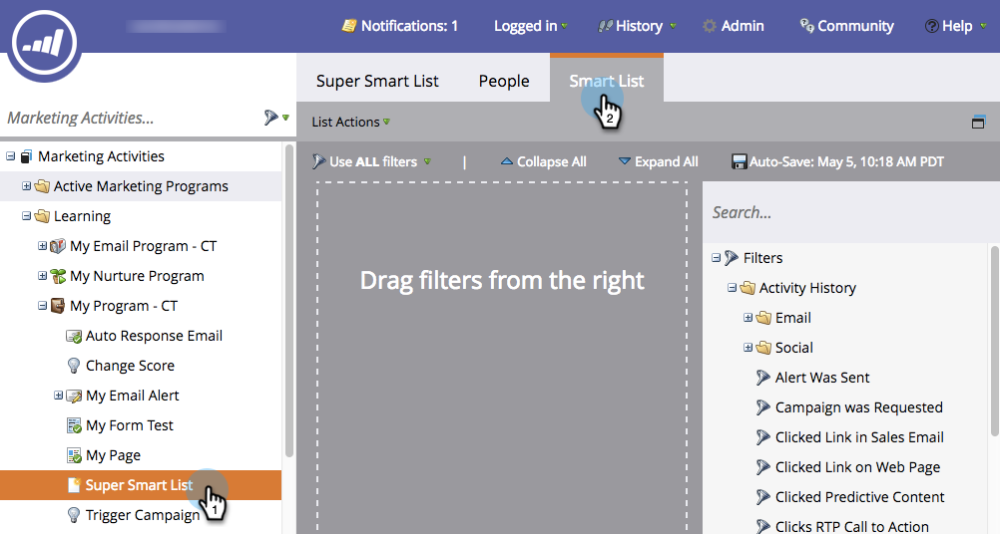

# Usar filtros de inactividad en una lista inteligente {#use-inactivity-filters-in-a-smart-list}

¿Sabía que puede buscar personas en una lista inteligente que *no* hayan hecho algo? Consulte estos filtros de inactividad.

1. Vaya a **Marketing Activities**.

   

1. Seleccione la lista inteligente que desea editar y, a continuación, haga clic en la pestaña **Smart List**.

   

1. Busque y arrastre el filtro de inactividad de su elección al lienzo. Por ejemplo, veamos personas que no hayan visitado ninguna de sus páginas.

   

   >[!TIP]
   >
   >Hay muchos filtros en la carpeta **Inactivity Filters**. Busque **Not** y desprotéjelas.

1. Seleccione el operador **is any** . Esto encontrará todas las personas que no han visitado ninguna página en los últimos 30 días.

   
