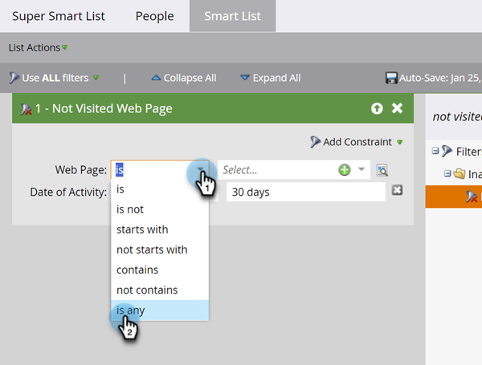

# Uso de filtros de inactividad en una lista inteligente {#use-inactivity-filters-in-a-smart-list}

¿Sabía que puede buscar personas en una lista inteligente que _no_ hayan hecho algo? Eche un vistazo a estos filtros de inactividad.

1. Vaya a **[!UICONTROL Actividades de marketing]**.

   

1. Seleccione la lista inteligente que desee editar y luego haga clic en la ficha **[!UICONTROL Lista inteligente]**.

   

1. Busque y arrastre el filtro de inactividad que desee al lienzo. Por ejemplo, vamos a buscar personas que no hayan visitado ninguna de sus páginas.

   

   >[!TIP]
   >
   >Hay muchos filtros en la carpeta **[!UICONTROL Filtros de inactividad]**. Busque &quot;No&quot; y compruébelo.

1. Seleccione el operador **[!UICONTROL is any]**. Así se encuentran todas las personas que no han visitado ninguna página en los últimos 30 días.

   
