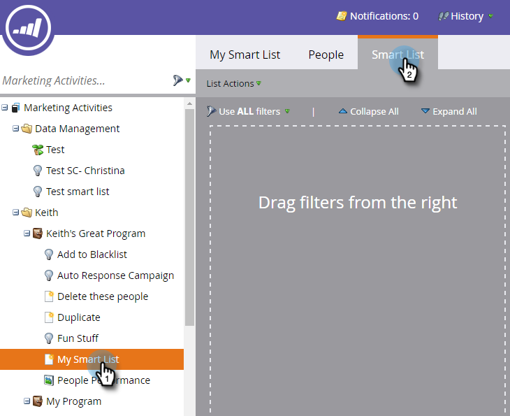

# Utilizar el filtro del valor de datos cambiado en una lista inteligente {#use-the-data-value-changed-filter-in-a-smart-list}

Los valores cambian constantemente y se actualizan en la base de datos de Marketo. A veces, en lugar de buscar un valor específico, desea buscar personas que hayan cambiado de valor. Así es como.

>[!PREREQUISITES]
>
>[Crear una lista inteligente](/help/marketo/product-docs/core-marketo-concepts/smart-lists-and-static-lists/creating-a-smart-list/create-a-smart-list.md)

1. Vaya al área **Marketing Activities** .

   

1. Seleccione la lista inteligente y haga clic en la pestaña **Smart List**.

   

1. Busque el filtro **Data Value Changed** y arrástrelo al lienzo.

   

1. Establezca **Attribute** en el campo en el que desea buscar los cambios de valor de datos.

   

Este filtro buscará todas las personas que hayan cambiado (cualquier cambio) su estado. Si desea mejorar aún más, intente [agregar una restricción a un filtro de lista inteligente](/help/marketo/product-docs/core-marketo-concepts/smart-lists-and-static-lists/using-smart-lists/add-a-constraint-to-a-smart-list-filter.md).
