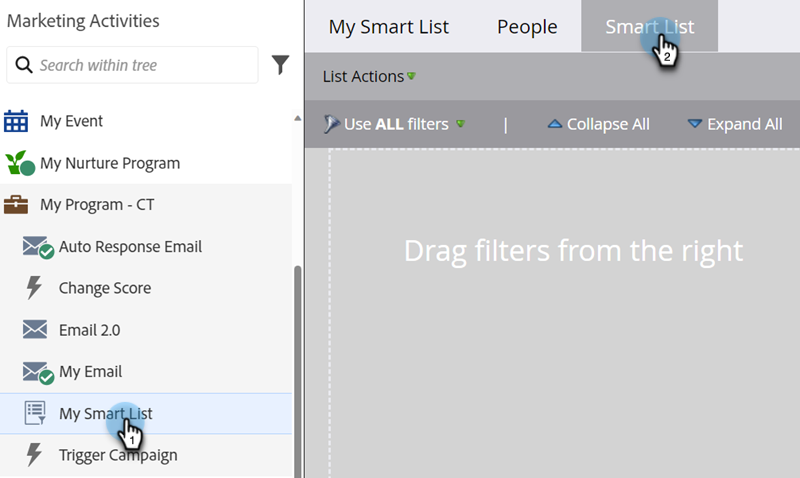

# Usar el filtro de valor de datos cambiado en una lista inteligente {#use-the-data-value-changed-filter-in-a-smart-list}

Los valores cambian constantemente y se actualizan en la base de datos de Marketo. A veces, en lugar de buscar un valor específico, desea buscar personas que hayan tenido un cambio en el valor.

>[!PREREQUISITES]
>
>[Crear una lista inteligente](/help/marketo/product-docs/core-marketo-concepts/smart-lists-and-static-lists/creating-a-smart-list/create-a-smart-list.md){target="_blank"}

1. Vaya al área **[!UICONTROL Actividades de marketing]**.

   

1. Seleccione la lista inteligente y haga clic en la ficha **[!UICONTROL Lista inteligente]**.

   

1. Busque el filtro **[!UICONTROL Valor de datos cambiado]** y arrástrelo al lienzo.

   

1. Establezca **[!UICONTROL Atributo]** en el campo en el que desea buscar cambios en el valor de los datos.

   

Este filtro buscará todas las personas que hayan cambiado (cualquier cambio) su estado. Si quieres ser más elegante, intenta [agregar una restricción a un filtro de Smart List](/help/marketo/product-docs/core-marketo-concepts/smart-lists-and-static-lists/using-smart-lists/add-a-constraint-to-a-smart-list-filter.md){target="_blank"}.
