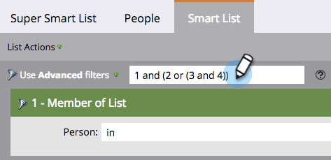

# Uso de la lógica de regla de lista inteligente avanzada {#using-advanced-smart-list-rule-logic}

Puede encontrar las personas exactas que necesita aplicando la lógica de regla de lista inteligente a varios filtros dentro de una lista inteligente. Así es como.

>[!PREREQUISITES]
>
>* [Buscar y agregar filtros a una lista inteligente](/help/marketo/product-docs/core-marketo-concepts/smart-lists-and-static-lists/creating-a-smart-list/find-and-add-filters-to-a-smart-list.md)
>* [Definir filtros de lista inteligente](/help/marketo/product-docs/core-marketo-concepts/smart-lists-and-static-lists/creating-a-smart-list/define-smart-list-filters.md)

>[!NOTE]
>
>La lógica de filtro avanzada solo está disponible si hay tres o más filtros en la lista inteligente.

## Añadir lógica a una lista inteligente {#add-logic-to-a-smart-list}

De forma predeterminada, la lista inteligente encuentra las personas que coinciden con los filtros **ALL** (filtros 1 _y_ 2 _y_ 3). Puede cambiar la lógica de regla para encontrar personas que coincidan con **ANY** de los filtros definidos (filtros 1 _o_ 2 _o_ 3), o usar filtros avanzados (filtros 1 _y_ 2 _o_ 3).

En este ejemplo, supongamos que desea encontrar personas en California _y_ con una puntuación de al menos 50 puntos _o_ con el estado &quot;Ventas calificadas&quot;.

1. Seleccione **Usar filtros avanzados** en la lista desplegable.

   

   >[!NOTE]
   >
   >El uso de filtros **Advanced** reduce la necesidad de crear listas inteligentes con el filtro Miembro de la lista inteligente . Esto ayuda a optimizar el rendimiento.

1. El cuadro de texto **Advanced filters** mostrará &quot;y&quot; como el valor predeterminado entre todos los filtros.

   

1. Escriba un par de paréntesis alrededor de &quot;2 y 3&quot;.

   

   >[!CAUTION]
   >
   >Debe utilizar &quot;y&quot; antes de &quot;o&quot; al introducir la lógica de regla.

1. Cambie &quot;y&quot; entre &quot;2 y 3&quot; por &quot;o&quot;.

   

## Utilice Paréntesis Para Combinar &quot;And&quot; Y &quot;Or {#use-parentheses-when-mixing-and-and-or}

La combinación de las lógicas &quot;y&quot; y &quot;o&quot; requiere paréntesis para aclarar su intención.

## Usar paréntesis anidados para cuatro o más filtros si es necesario {#use-nested-parentheses-for-four-or-more-filters-if-needed}

Según su intención, es posible que tenga que añadir paréntesis anidados al utilizar cuatro o más filtros.

>[!TIP]
>
>Si introduce una regla no válida, verá una línea roja debajo de la regla. Desplácese por el texto para ver el mensaje de error relacionado.
