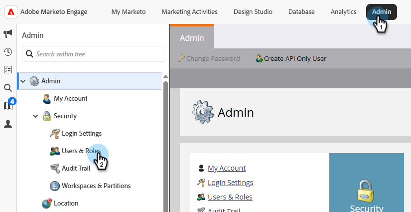
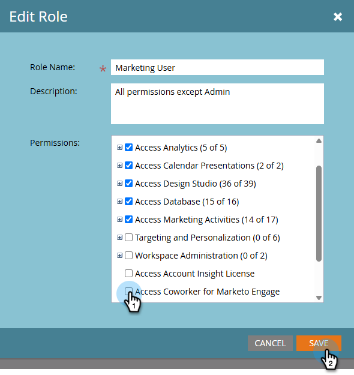
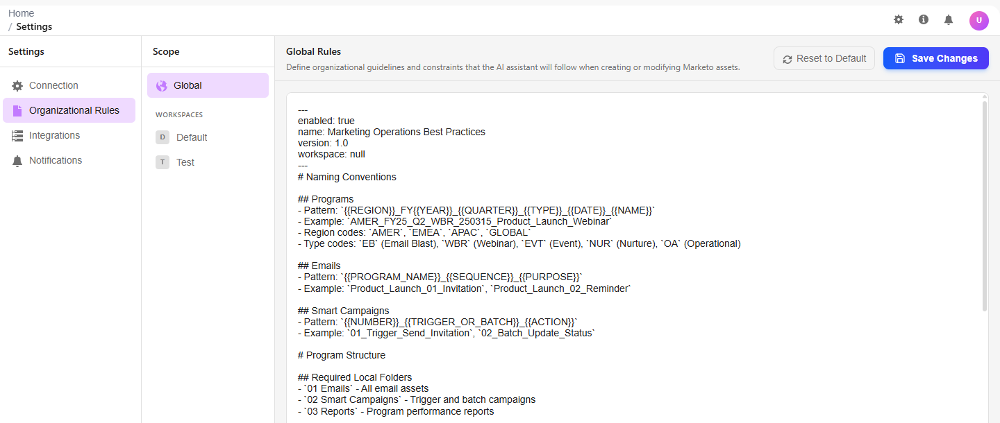

# Configuración y configuración {#settings-setup}

Obtenga información sobre cómo habilitar permisos y utilizar el área Configuración para ver los detalles de conexión, definir reglas organizativas y configurar integraciones y notificaciones.

>[!AVAILABILITY]
>
>Esta función está disponible para todas las suscripciones. Si no ve el mosaico Colaborador para Marketo Engage en la pantalla de Mi Marketo, póngase en contacto con su administrador de cuentas de. También debe aceptar los términos de la [generación principal de IA y los términos complementarios](https://www.adobe.com/legal/terms/enterprise-licensing/genai-ww.html){target="_blank"}.

## Permisos y funciones {#permission-and-role}

Hay un permiso de _Colaborador de acceso para Marketo Engage_ y un rol de _Colaborador para usuario de Marketo Engage_, lo que proporciona a los administradores un mayor control sobre los usuarios que pueden acceder a la función de **Colaborador para Marketo Engage**. El permiso se asigna en el nivel de rol. El rol _Colaborador para el usuario de Marketo Engage_ viene con el permiso _Acceder al colaborador para Marketo Engage_ habilitado de forma predeterminada.

>[!NOTE]
>
>El permiso _Acceder al compañero de trabajo para Marketo Engage_ no está habilitado de forma predeterminada para todos los roles. Consulte la tabla siguiente para obtener más información.

| Función | Estado predeterminado |
| --- | --- |
| Administrador | Habilitado |
| Administrador de productos de Adobe | Habilitado |
| Usuario de marketing | Desactivado |
| Usuario estándar | No disponible |
| Compañero de trabajo para el usuario de Marketo Engage | Habilitado |
| Funciones personalizadas | Desactivado |

### Permiso Acceder a Compañero para Marketo Engage {#access-coworker-marketo-permission}

Siga los pasos a continuación para habilitar _Acceder a Compañero de trabajo para Marketo Engage_ para roles calificadores que aún no lo tengan habilitado.

1. En Mi Marketo, haz clic en **Administrador**, luego en **Usuarios y roles**.

   

1. En la ficha _Roles_, seleccione el rol que desee y haga clic en **Editar rol**.

   

1. Desplácese hacia abajo y marque la casilla de verificación _Acceder a Compañero de trabajo para Marketo Engage_ y haga clic en **Guardar**.

   

   >[!NOTE]
   >
   >Puede seguir los mismos pasos para quitar el permiso: **un** marca la casilla de verificación _Acceder al compañero de trabajo de Marketo Engage_.

### Colaborador para la función de usuario de Marketo Engage {#coworker-marketo-user-role}

Siga estos pasos para asignar un usuario específico al rol _Colaborador para el usuario de Marketo Engage_.

>[!NOTE]
>
>Este rol **solamente** contiene el permiso de _Acceder a los compañeros para Marketo Engage_.

1. En Mi Marketo, haz clic en **Administrador**, luego en **Usuarios y roles**.

   

1. Seleccione el usuario que desee y haga clic en **Editar usuario**.

   

1. En _Roles y espacios de trabajo_, active la casilla de verificación _Colaborador para usuario de Marketo Engage_. Si tiene más de un área de trabajo, puede especificar cuáles recibirán acceso en la lista desplegable de signo **+**. Haga clic en **Guardar** cuando termine.

   

### Función personalizada {#custom-role}

También tiene la opción de [crear una nueva función](https://experienceleague.adobe.com/es/docs/marketo/using/product-docs/administration/users-and-roles/create-delete-edit-and-change-a-user-role#create-a-role){target="_blank"} y personalizar sus permisos, agregando _Colaborador de acceso para Marketo Engage_, junto con cualquier otra cosa que desee, y [asignando esa función](https://experienceleague.adobe.com/es/docs/marketo/using/product-docs/administration/users-and-roles/managing-user-roles-and-permissions#assign-roles-to-a-user){target="_blank"} a usuarios específicos.

## Configuración {#settings}

1. En Mi Marketo, haga clic en el icono **[!UICONTROL Colaborador de Marketo Engage]**.

   

1. Haga clic en el icono de engranaje.

   

### Connection {#connection}

Esta pestaña no contiene campos editables. Muestra información de la cuenta, como su Munchkin ID y su organización IMS.

### Reglas organizativas {#organizational-rules}

Defina las directrices y restricciones organizativas que el colaborador de Marketo Engage sigue al crear o modificar recursos de Marketo Engage.

{width="800" zoomable="yes"}

>[!NOTE]
>
>Las reglas utilizan el formato Markdown con YAML frontmatter. Las reglas globales se aplican a todos los espacios de trabajo. Las reglas de Workspace anulan la configuración global.

### Integraciones (próximamente) {#integrations}

Configure conexiones a servicios externos y API.

_Esta ficha puede aparecer en la interfaz de usuario, pero aún no está disponible para su uso. Vuelva a buscar actualizaciones_.

### Notificaciones (próximamente) {#notifications}

Administrar las preferencias de alerta y los canales de notificación.

_Esta ficha puede aparecer en la interfaz de usuario, pero aún no está disponible para su uso. Consulte este artículo para ver las actualizaciones_.
