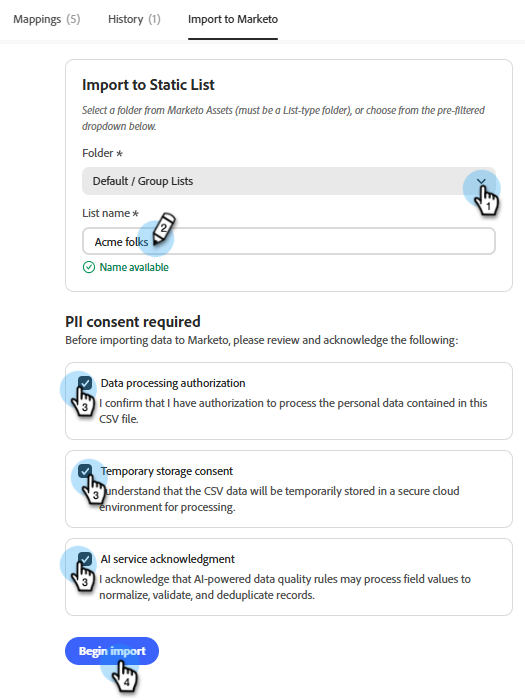

# Importar posibles clientes {#import-leads}

Importe y deduplique listas de posibles clientes en la base de datos de Marketo Engage con ayuda de asignación de campos.

## Cómo usar {#how-to-use}

1. En Mi Marketo, haga clic en el icono **Colaborador de Marketo Engage**.

   

1. Escriba &quot;Importar una lista de posibles clientes y normalizar los datos&quot; (o selecciónela si aparece como un mensaje de ejemplo) y haga clic en el icono de flecha arriba.

   

1. Se le pedirá que cargue el archivo CSV y se le mostrarán los pasos siguientes.

   

1. Haga clic en el icono **+** y seleccione **Cargar archivo**. Busque y cargue su archivo CSV.

   

1. Haga clic en el icono de flecha arriba.

   

1. Haz clic en **Revisar** para ver tu lista en la consola central.

   

1. Compruebe las reglas empresariales disponibles para limpiar la lista. Introduzca el que desee y haga clic en el icono de flecha hacia arriba.

   

   Los resultados aparecen en la consola central.

   

   Si lo desea, introduzca reglas comerciales adicionales.

1. Para ver los campos asignados, haga clic en la ficha **Asignaciones**.

1. Si algún campo se asignó incorrectamente, corríjalo aquí cambiando el **campo de destino**.

   

1. Cuando esté listo para importar su lista, haga clic en la ficha **Importar a Marketo**.

1. Seleccione la carpeta de destino e introduzca un nombre. Marque cada casilla de consentimiento y haga clic en **Comenzar importación**.

   

   Cuando termina la importación, aparece un resumen de verificación que muestra los posibles clientes procesados, las filas con errores y las advertencias.
