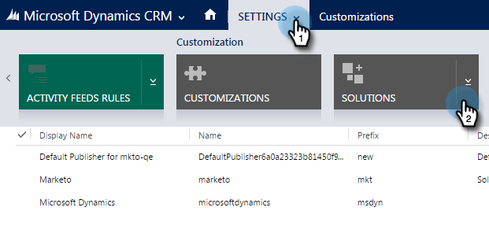

# Establecer un prefijo de campo personalizado predeterminado {#set-a-default-custom-field-prefix}

El prefijo predeterminado [!DNL Microsoft Dynamics] de los campos personalizados debe ser **new** para que los campos propietarios de Marketo se sincronicen correctamente.

1. Vaya a [!UICONTROL Configuración] y seleccione **[!UICONTROL Personalizaciones].**

   

1. Haga clic en **[!UICONTROL Publicadores]**.

   

1. Seleccione el editor predeterminado en la lista.

   

1. Cambie el prefijo a **new**. Haga clic en **[!UICONTROL Guardar y cerrar]**.

   

1. Vaya a [!UICONTROL Configuración] > [!UICONTROL Soluciones] para publicar las personalizaciones.

   

1. Haga clic en **[!UICONTROL Publicar todas las personalizaciones]**.

   

1. Ahora, cree sus campos personalizados. Una vez completados, revierta el prefijo al original.
