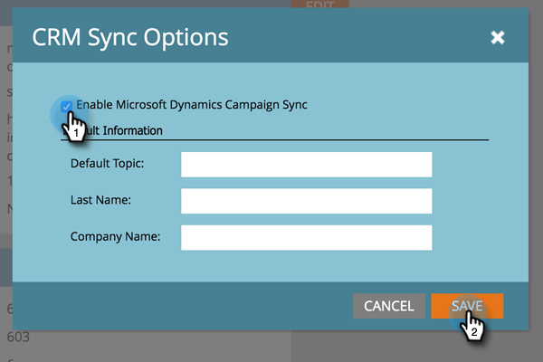

# Habilitar sincronización de campaña {#enable-campaign-sync}

Esta opción permite que Marketo agregue y elimine miembros de [!DNL MS Dynamics] Campaign.

>[!PREREQUISITES]
>
>Actualice a la última versión del complemento [!DNL Dynamics] para Marketo.

>[!NOTE]
>
>**Se requieren permisos de administrador**

1. En tu **[!UICONTROL Mi Marketo]**, haz clic en **[!UICONTROL Administrador]**.

   

1. Haga clic en **[!UICONTROL Microsoft Dynamics]**.

   

1. En **[!UICONTROL Opciones de sincronización]**, haga clic en **[!UICONTROL Editar]**.

   

1. Seleccione la casilla de verificación **[!UICONTROL Habilitar sincronización de Microsoft Dynamics Campaign]** y haga clic en **[!UICONTROL Guardar]**.

   

Asigne un tiempo a la sincronización para extraer los datos de [!DNL Microsoft Dynamics].

>[!NOTE]
>
>Al restablecer la casilla de verificación [!DNL Dynamics] Campaign Sync se actualizarán todos los datos de Campaign sincronizados anteriormente y las asociaciones con las listas de marketing de [!DNL Dynamics].
