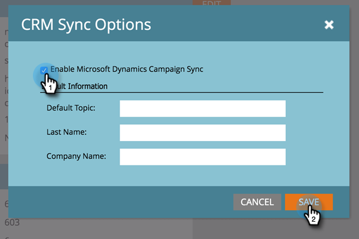

# Habilitar sincronización de campaña {#enable-campaign-sync}

Esta opción permite a Marketo añadir y eliminar miembros de MS Dynamics Campaign.

>[!PREREQUISITES]
>
>Actualice a la última versión del complemento de Dynamics para Marketo.

>[!NOTE]
>
>**Permisos de administración necesarios**

1. En Mi Marketo, haga clic en **Administrador**.

   

1. Clic **Microsoft Dynamics**.

   

1. En Opciones de sincronización, haga clic en **Editar**.

   

1. Seleccione el **Habilitar sincronización de campaña de Microsoft Dynamics** y haga clic en **Guardar**.

   

Ahí lo tienes. Solo tiene que darle a la sincronización un poco de tiempo para extraer los datos de Microsoft Dynamics y ya está listo.

>[!NOTE]
>
>Al restablecer la casilla de verificación Sincronización de Dynamics Campaign, se actualizarán todos los datos de Campaign sincronizados anteriormente y las asociaciones con las listas de marketing en Dynamics.
