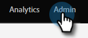
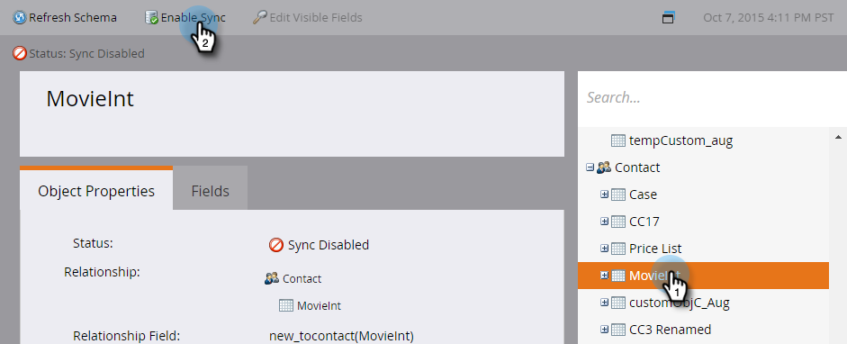
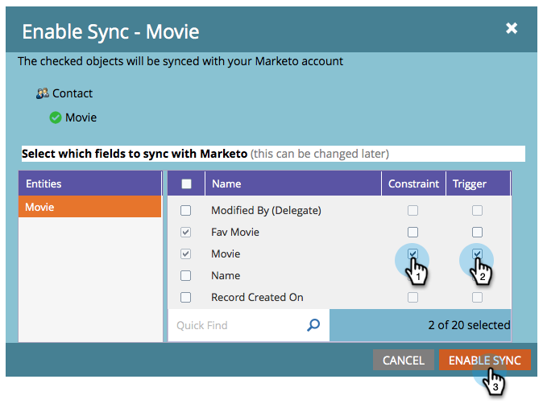
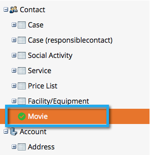

# Habilitar sincronización para una entidad personalizada {#enable-sync-for-a-custom-entity}

Si necesita que los datos de entidad personalizados de [!DNL Dynamics] estén disponibles en Marketo Engage, siga los pasos a continuación.

>[!PREREQUISITES]
>
>Para usar un objeto personalizado, debe estar asociado a un objeto [lead](/help/marketo/product-docs/crm-sync/microsoft-dynamics-sync/microsoft-dynamics-sync-details/microsoft-dynamics-sync-lead-sync.md){target="_blank"}, [contact](/help/marketo/product-docs/crm-sync/microsoft-dynamics-sync/microsoft-dynamics-sync-details/microsoft-dynamics-sync-contact-sync.md){target="_blank"} o [account](/help/marketo/product-docs/crm-sync/microsoft-dynamics-sync/microsoft-dynamics-sync-details/microsoft-dynamics-sync-account-sync.md){target="_blank"} en Microsoft Dynamics.

>[!NOTE]
>
>* Cuando se habilita la sincronización para una entidad personalizada, Marketo realiza una sincronización inicial para incluir todos los datos del objeto personalizado.
>* Los miembros de la lista de marketing y de la lista de marketing _no son compatibles_ en este momento.

>[!IMPORTANT]
>
>El usuario de sincronización de Marketo necesita acceso de lectura al objeto personalizado para enumerarlo y realizar una sincronización con él.

1. Vaya a la sección **[!UICONTROL Admin]**.

   

1. Seleccione **[!UICONTROL Microsoft Dynamics]** y haga clic en **[!UICONTROL Deshabilitar sincronización]**.

   

   >[!NOTE]
   >
   >Debe deshabilitar la sincronización global temporalmente para habilitar o deshabilitar una entidad personalizada.

1. En [!UICONTROL Administración de bases de datos], haga clic en el vínculo **[!UICONTROL Sincronizar entidades de Dynamics]**.

   

1. Haga clic en el vínculo **[!UICONTROL Sincronizar esquema]**.

   

1. Seleccione la entidad que desea sincronizar y haga clic en **[!UICONTROL Habilitar sincronización]**.

   

1. Seleccione los campos que desee sincronizar o usar como [restricciones](/help/marketo/product-docs/core-marketo-concepts/smart-lists-and-static-lists/using-smart-lists/add-a-constraint-to-a-smart-list-filter.md) o déclencheur en listas inteligentes. Cuando termine, haga clic en **[!UICONTROL Habilitar sincronización]**.

   

   >[!NOTE]
   >
   >Durante el proceso de sincronización, es posible que observe que el elemento &quot;[!UICONTROL Sincronización de entidades dinámicas]&quot; desaparece del árbol de navegación. Este es el comportamiento esperado y volverá a aparecer una vez completada la sincronización.

1. La entidad ahora tiene una marca de verificación verde.

   

1. Vuelva a habilitar la sincronización global.

   

   >[!NOTE]
   >
   >* Marketo solo admite entidades personalizadas vinculadas a entidades estándar de uno o dos niveles de profundidad.
   >
   >* El árbol de objetos personalizados puede mostrar el mismo objeto más de una vez, debido a sus conexiones directas con uno de los objetos principales (por ejemplo, posibles clientes, contactos o cuentas o conexiones indirectas a través de objetos intermediarios). En estos casos, elija el objeto más cercano al objeto principal y elija solo uno. Si elige el mismo objeto varias veces, puede que la sincronización de ese objeto personalizado se vea obstaculizada.
