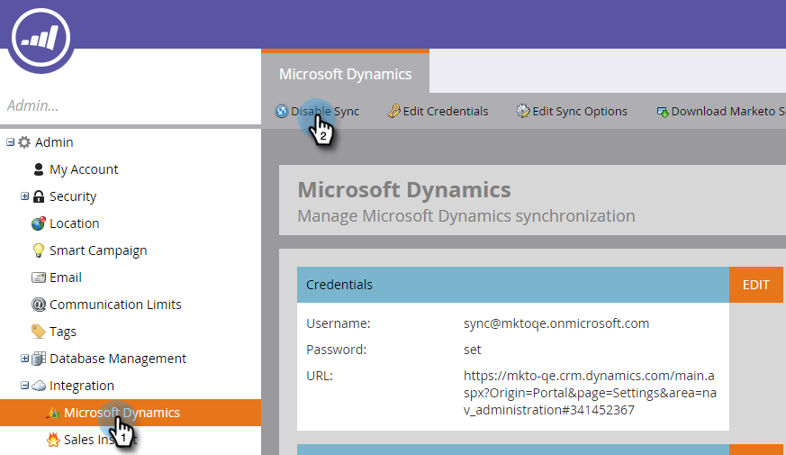

# Microsoft Dynamics Sync: Sincronización de entidades personalizadas {#microsoft-dynamics-sync-custom-entity-sync}

Si necesita habilitar la sincronización de entidad personalizada inicial para que los datos de Dynamics estén disponibles en Marketo, así es como hacerlo.

>[!NOTE]
>
>**Se requieren permisos de administrador**

>[!PREREQUISITES]
>
>Para utilizar un objeto personalizado, debe estar asociado a un objeto [lead](/help/marketo/product-docs/crm-sync/microsoft-dynamics-sync/microsoft-dynamics-sync-details/microsoft-dynamics-sync-lead-sync.md), [contact](/help/marketo/product-docs/crm-sync/microsoft-dynamics-sync/microsoft-dynamics-sync-details/microsoft-dynamics-sync-contact-sync.md) o [account](/help/marketo/product-docs/crm-sync/microsoft-dynamics-sync/microsoft-dynamics-sync-details/microsoft-dynamics-sync-account-sync.md)en Dynamics.

>[!CAUTION]
>
>Asegúrese de que la sincronización inicial se haya completado (se le notificará por correo electrónico) antes de comenzar la sincronización para entidades personalizadas.

1. Vaya a la sección Administración .

   

1. Haga clic en **Deshabilitar sincronización** para deshabilitar temporalmente la sincronización global estándar.

   

1. Instale una versión de Microsoft Dynamics que admita la sincronización de entidades personalizada (después de 2_0_0_2). Consulte [Versiones del complemento de Marketo para Microsoft Dynamics](/help/marketo/product-docs/crm-sync/microsoft-dynamics-sync/marketo-plugin-releases-for-microsoft-dynamics.md).

1. Proporcione al usuario de sincronización de Marketo acceso de lectura a las entidades que planee sincronizar.

1. En Administración de bases de datos, haga clic en el enlace **Sincronización de entidades de Dynamics**.

   

1. Haga clic en el vínculo **Sync schema** para traer la lista de entidades personalizadas disponibles.

   

1. Una vez sincronizada la lista, seleccione los campos que desee sincronizar y los que desee utilizar como [restricciones](/help/marketo/product-docs/core-marketo-concepts/smart-lists-and-static-lists/using-smart-lists/add-a-constraint-to-a-smart-list-filter.md) y/o déclencheur en listas inteligentes. Cuando termine, haga clic en **Habilitar sincronización**.

   

1. Vuelva a habilitar la sincronización global.

   

   >[!NOTE]
   >
   >Marketo solo admite entidades personalizadas vinculadas a entidades estándar con una o dos niveles de profundidad.

   >[!NOTE]
   >
   >Los nombres de entidades pueden tener un máximo de **33 caracteres**.

¡Eres bueno!
