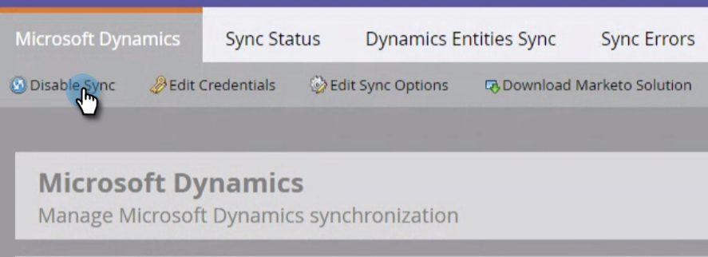
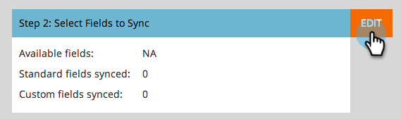
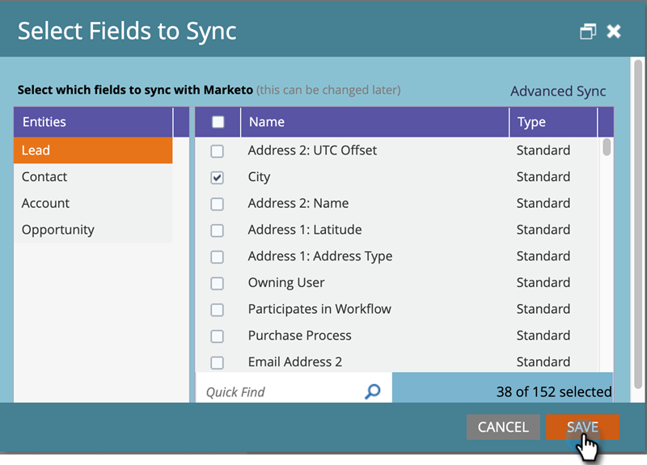

# Edición de campos para sincronizar antes de eliminarlos en [!DNL Dynamics] {#editing-fields-to-sync-before-deleting-them-in-dynamics}

A veces es posible que desee eliminar campos en [!DNL Dynamics]. Marketo mantiene la lista de campos como referencia en la que basar la sincronización. Si se elimina un campo en [!DNL Dynamics] mientras la sincronización está activada, la sincronización podría encontrar errores. Antes de eliminar cualquier campo, siga los pasos a continuación.

1. En Marketo, haga clic en **[!UICONTROL Administrador]**.

   

1. En [!UICONTROL Integración], haga clic en **[!UICONTROL Microsoft Dynamics]**.

   

1. Haga clic en **[!UICONTROL Deshabilitar sincronización]**.

   

1. En una nueva pestaña del explorador, inicie sesión en [!DNL Dynamics] y elimine los campos que desee.

1. En Marketo, en [!DNL Microsoft Dynamics], haga clic en **[!UICONTROL Editar]** junto a &quot;[!UICONTROL Paso 2: Seleccionar campos para sincronizar]&quot;.

   

1. Revise los campos y haga clic en **[!UICONTROL Guardar]**.

   

>[!CAUTION]
>
>Se requiere hacer clic en **[!UICONTROL Guardar]** para guardar el esquema actualizado para la sincronización, aunque no se hayan realizado cambios.

>[!NOTE]
>
>Si la sincronización no se detiene antes de eliminar un campo en [!DNL Dynamics], la sincronización puede encontrar errores. Si es así, la sincronización se detendrá. Antes de continuar, el administrador de Marketo tendría que revisar &quot;[!UICONTROL Seleccionar campos para sincronizar]&quot; (mencionado anteriormente) y hacer clic en **[!UICONTROL Guardar]** para que la sincronización acepte los cambios de esquema.

Recuerde habilitar la sincronización después de guardar los cambios.
