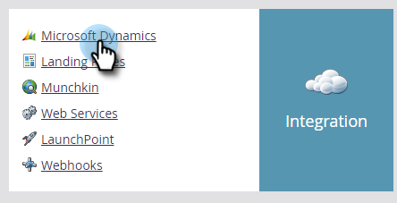
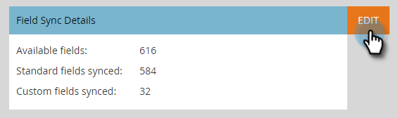
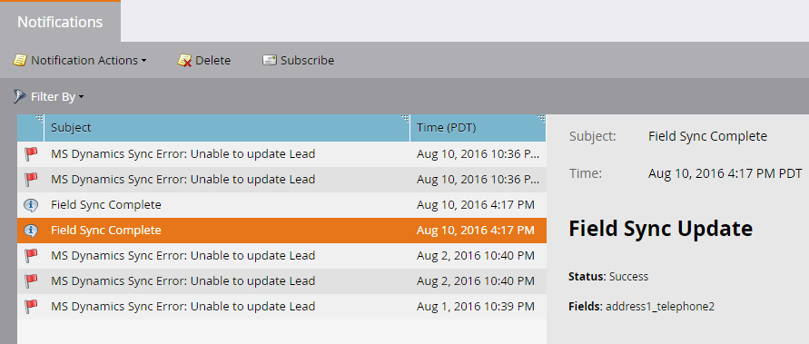
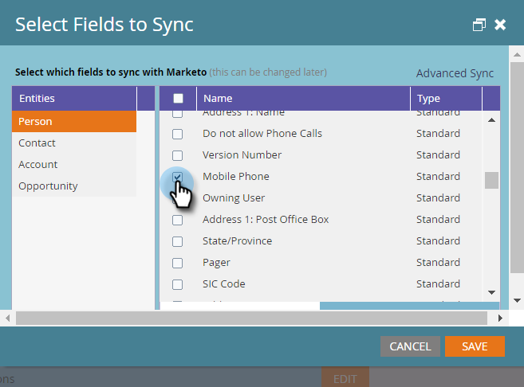
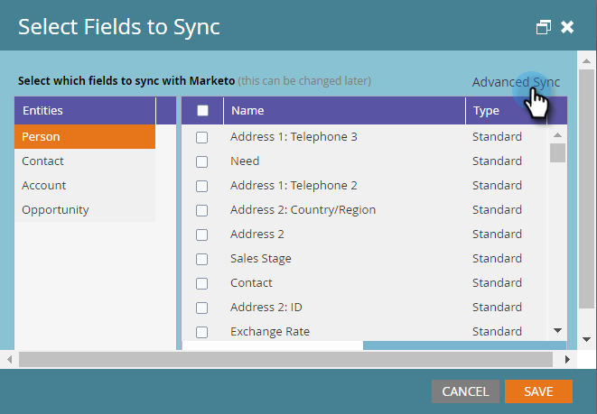
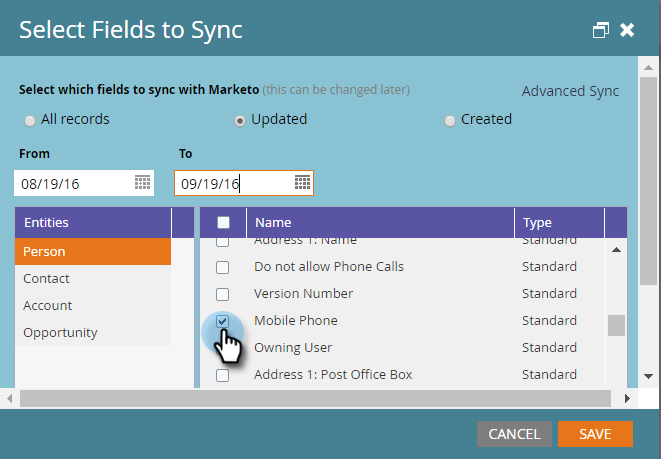
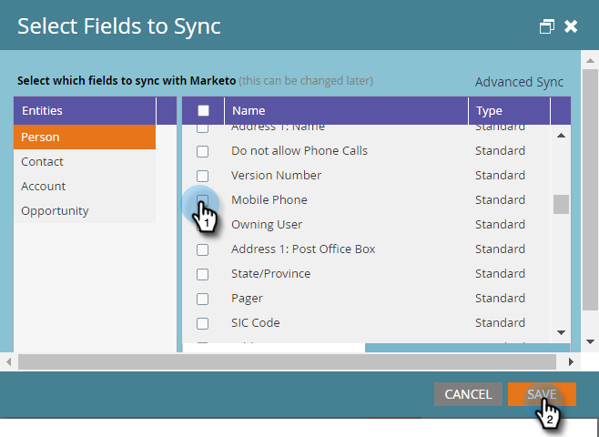
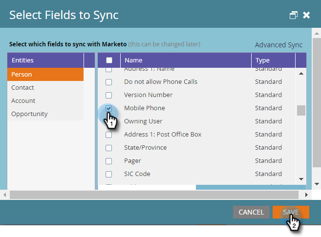

# Usar sincronización rápida con [!DNL Microsoft Dynamics] para un nuevo campo personalizado {#use-quick-sync-with-microsoft-dynamics-for-a-new-custom-field}

Marketing o Ventas desea un nuevo campo. O quizás olvidó uno en su selección inicial de campo. O, sus necesidades cambiaron. En cualquier caso, puede utilizar la sincronización rápida para volver a sincronizar campos específicos.

Normalmente, la sincronización rápida se utiliza para agregar un nuevo campo y actualizar los valores. Sin embargo, hay casos en los que es posible que desee sincronizar un campo existente. Puede restringir la sincronización de campos en función de un intervalo de fechas actualizado o creado. Consulte [Opciones de sincronización avanzadas](#Advanced_Sync_Options) más abajo para obtener más información.

La sincronización rápida puede sincronizar valores nulos. Por ejemplo, si está utilizando los valores A y B y cambia el valor B de [!DNL Dynamics] a nulo, sincronizará el valor nulo con Marketo.

## Sincronización rápida para todos los registros {#quick-sync-for-all-records}

1. En Marketo, haga clic en **[!UICONTROL Administrador]**.

   

1. Haga clic en **[!UICONTROL Microsoft Dynamics]**.

   

1. En [!UICONTROL Detalles de sincronización de campos], haga clic en **[!UICONTROL Editar]**.

   

1. Seleccione los campos que desea sincronizar rápidamente y haga clic en **[!UICONTROL Guardar]**.

   

   >[!NOTE]
   >
   >Puede seleccionar campos de varias entidades.

1. Recibirá una notificación cuando se complete la sincronización.

   

   >[!CAUTION]
   >
   >La sincronización se ejecuta en paralelo con otras sincronizaciones y, según el tamaño de la base de datos, puede tardar mucho tiempo en completarse. Cuando un campo está en cola para sincronizarse, no se puede anular su selección.

## Opciones de sincronización avanzadas {#advanced-sync-options}

¿Qué sucede si desea sincronizar un campo existente pero solo lo hace para un conjunto limitado de datos?

1. Desactive la casilla de verificación de un campo existente. Haga clic en **[!UICONTROL Guardar]**.

   

1. Vuelva a abrir la ventana emergente y vuelva a seleccionar el campo.

   

1. Haga clic en **[!UICONTROL Sincronización avanzada]**.

   

1. Elija **[!UICONTROL Actualizado]** y seleccione un intervalo de fechas utilizando los selectores de fechas. Haga clic en **[!UICONTROL Guardar]**.

   

   Solo se sincronizarán rápidamente los registros actualizados entre el 19/8/16 y el 19/9/16 para el campo.

## Corrección de campos no sincronizados {#fixing-out-of-sync-fields}

En el improbable caso de que un campo de [!DNL Dynamics] y Marketo no estén sincronizados, existe una forma rápida de volver a sincronizarlos.

1. Anule la selección del campo y haga clic en **[!UICONTROL Guardar]**.

   

1. Vuelva a seleccionar el campo y haga clic en **[!UICONTROL Guardar]**.

   

   ¡Eso debería arreglarlo!
