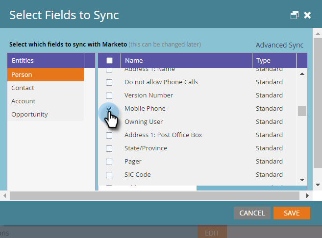

# Usar la sincronización rápida con Microsoft Dynamics para un nuevo campo personalizado {#use-quick-sync-with-microsoft-dynamics-for-a-new-custom-field}

Marketing o ventas quiere un nuevo campo. O, tal vez olvidó uno en su selección inicial de campo. O bien, sus necesidades han cambiado. En cualquier caso, puede utilizar la sincronización rápida para volver a sincronizar campos específicos.

Normalmente, se utiliza la sincronización rápida para agregar un campo nuevo y se actualizan los valores. Sin embargo, hay casos en los que puede que desee sincronizar un campo existente. Puede restringir la sincronización de campos en función de un intervalo de fechas actualizado o creado. Consulte [Opciones de sincronización avanzadas](#Advanced_Sync_Options) a continuación para obtener más información.

La sincronización rápida puede sincronizar valores nulos. Por ejemplo, si está utilizando los valores A y B y cambia un valor B en Dynamics a null, sincronizará el valor nulo con Marketo.

## Sincronización rápida para todos los registros {#quick-sync-for-all-records}

A continuación se explica cómo utilizar la sincronización rápida para volver a sincronizar los campos nuevos.

1. En Marketo, haga clic en **Administrador**.

   

1. Haga clic en **Microsoft Dynamics**.

   

1. En Detalles de sincronización de campos, haga clic en **Editar**.

   

1. Seleccione los campos que desea sincronizar rápidamente y haga clic en **Guardar**.

   

   >[!NOTE]
   >
   >Puede seleccionar campos de varias entidades.

1. Recibirá una notificación cuando se complete la sincronización.

   

   >[!CAUTION]
   >
   >La sincronización se ejecuta en paralelo con otras sincronizaciones y, según el tamaño de la base de datos, puede tardar mucho tiempo en completarse. Cuando un campo está en cola para su sincronización, no se puede anular la selección.

## Opciones de sincronización avanzadas {#advanced-sync-options}

¿Qué sucede si desea sincronizar un campo existente, pero solo lo hace para un conjunto limitado de datos? Así es como.

1. Desactive la casilla de verificación de un campo existente. Haga clic en **Guardar**.

   

1. Vuelva a abrir la ventana emergente y vuelva a seleccionar el campo .

   

1. Haga clic en **Sincronización avanzada**.

   

1. Choose **Actualizado** y seleccione un intervalo de fechas utilizando los selectores de fechas. Haga clic en **Guardar**.

   

   Solo los registros actualizados entre el 19/8/16 y el 19/9/16 se sincronizarán rápidamente para el campo.

## Corrección de campos de sincronización {#fixing-out-of-sync-fields}

En el improbable caso de que un campo de Dynamics y Marketo no esté sincronizado, hay una forma rápida y sencilla de resincronizarlos.

1. Anule la selección del campo y haga clic en **Guardar**.

   

1. Vuelva a seleccionar el campo y haga clic en **Guardar**. ¡Eso es todo!

   

   ¡Eso debería arreglarlo!
