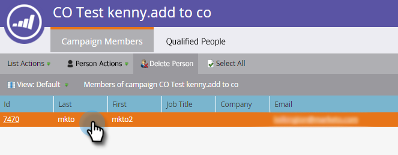

# Crear un contacto en Microsoft Dynamics {#create-a-contact-in-microsoft-dynamics}

1. Seleccione la única persona de Marketo (el tipo de Microsoft está vacío) que desea crear como contacto en Dynamics.

   

1. Haga clic en **Acciones de persona** y **Microsoft** y seleccione **Sincronizar persona con Microsoft**.

   

1. Haga clic en **Sincronizar como** y seleccione **Contacto**. Haga clic en **Ejecutar ahora**.

   

   >[!NOTE]
   >
   >Al utilizar la acción de flujo &quot;Sincronizar persona con Microsoft&quot; (solo en una campaña de déclencheur), el posible cliente o contacto se creará en tiempo real en Dynamics.

1. Marketo clasifica ese registro de posible cliente en Dynamics en un contacto que no está asociado a ninguna cuenta de Dynamics.

   

1. Ahora puede seleccionar **Contacto** cuando utiliza la restricción Sincronizar como en un filtro de campaña inteligente.

   
