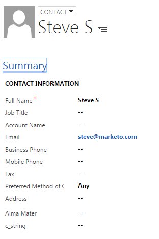

# Crear un contacto en [!DNL Microsoft Dynamics] {#create-a-contact-in-microsoft-dynamics}

1. Seleccione la persona solo de Marketo Engage (el tipo de Microsoft está vacío) que desee crear como contacto en Dynamics.

   

1. Haga clic en **[!UICONTROL Acciones de persona]** y **[!DNL Microsoft]**, y seleccione **[!UICONTROL Sincronizar persona con Microsoft]**.

   

1. Haga clic en **[!UICONTROL Sincronizar como]** y seleccione **[!UICONTROL Contacto]**. Haga clic en **[!UICONTROL Ejecutar ahora]**.

   

   >[!NOTE]
   >
   >Al usar la acción de flujo &quot;[!UICONTROL Sincronizar persona con Microsoft]&quot; (solo en una campaña de Déclencheur), el posible cliente/contacto se creará en tiempo real en Dynamics.

1. Marketo convierte ese registro de posible cliente de [!DNL Dynamics] en un contacto que no está asociado a ninguna cuenta de [!DNL Dynamics].

   

1. Ahora, puedes seleccionar **[!UICONTROL Contacto]** cuando uses la restricción Sincronizar como en un filtro de campaña inteligente.

   
