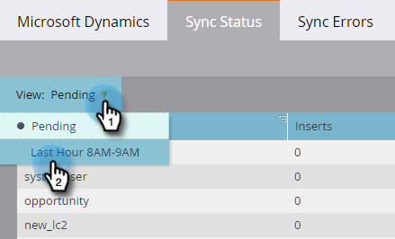

# Estado de sincronización {#sync-status}

Puede mantener un registro del rendimiento actual y del trabajo pendiente del proceso de sincronización en las fichas Estado de sincronización y Errores de sincronización.

## Ficha Estado de sincronización {#sync-status-tab}

1. Haga clic en **Administrador** y **Microsoft Dynamics**.

   

1. Haga clic en la ficha **Sincronizar estado** .

   

   Esta tabla muestra el trabajo pendiente de inserciones y actualizaciones que aún no se han sincronizado para cada objeto.

1. Haga clic con el botón doble en cualquier fila para consultar la información de oportunidad de vista.

   

   Los detalles del estado de sincronización se desglosan mediante inserciones y actualizaciones, y los registros de inserción y actualización más antiguos.

   

1. Haga clic en la **Vista: **menú desplegable** **y seleccione **Última hora **para obtener información sobre el rendimiento de la vista.

   

   La visualización ahora muestra el número de registros sincronizados en la última hora completa (por ejemplo, de 1 a 2 p.m.).

   

   >[!NOTE]
   >
   >Cuando está viendo la vista Última hora, las columnas Inserciones y actualizaciones muestran N/D. Este es el comportamiento esperado.

## Ficha Errores de sincronización {#sync-errors-tab}

Examinar, buscar o exportar leads (y otros objetos) que no se hayan podido sincronizar con detalles como operación, dirección, código de error y mensaje de error.

>[!NOTE]
>
>**Artículos relacionados**
>
>* [Tipos de notificaciones](../../../../product-docs/core-marketo-concepts/miscellaneous/understanding-notifications/notification-types.md)

