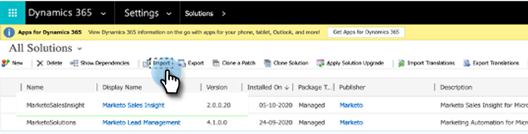

# Versiones de complementos para Microsoft Dynamics MSI {#plug-in-releases-for-microsoft-dynamics-msi}

La primera vez que sincroniza con Microsoft Dynamics, descarga e instala la última versión de los complementos para Marketo Sales Insight (MSI). Marketo actualiza periódicamente estos complementos para que pueda volver al mismo lugar y descargar la nueva versión.

Por favor [descargar el complemento más reciente](/help/marketo/product-docs/marketo-sales-insight/msi-for-microsoft-dynamics/installing/download-the-marketo-sales-insight-solution-for-microsoft-dynamics.md) correspondiente a su versión de Dynamics.

>[!NOTE]
>
>Estas versiones funcionan tanto para las versiones locales como en línea de Dynamics.

## Actualización de la solución MSI {#upgrading-your-msi-solution}

1. Importar la última versión de la solución _sobre la versión existente_ de su Dynamics CRM pulsando el botón **Importar** en Dynamics.

   

>[!NOTE]
>
>Ejemplo: si su Dynamics CRM tiene la versión 2.0.0.20 y la versión más reciente es 2.0.0.21, importaría _over_ versión 2.0.0.20.

1. Haga clic en **Siguiente**.

   

1. Select **Fase de actualización** y **Mantener personalizaciones** y haga clic en **Importar**.

   

1. Haga clic en **Siguiente**.

   

1. Después de una importación correcta, verá dos soluciones de MSI: MarketoSalesInsight y MarketoSalesInsight_Upgrade. Seleccione la solución anterior y haga clic en Aplicar actualización de solución.

   

¡Y eso es todo! Después de la actualización solo verá una solución MSI.

## Actualizaciones de versiones {#version-updates}

<table> 
 <colgroup> 
  <col> 
  <col> 
  <col> 
 </colgroup> 
 <tbody> 
  <tr> 
   <th colspan="1">Fecha de versión</th> 
   <th colspan="1">Versión</th> 
   <th colspan="1">Notas</th> 
  </tr> 
  <tr> 
   <td colspan="1">3/2/22</td> 
   <td colspan="1">2.0.0.27</td> 
   <td colspan="1">Diseño de cuenta para perspectivas: Momentos interesantes, cambios de puntuación, actividades web, actividades de correo electrónico</td> 
  </tr>
  <tr> 
   <td colspan="1">5/1/22</td> 
   <td colspan="1">2.0.0.26</td> 
   <td colspan="1">Puntuación de adopción de programa para enviar correo electrónico</td> 
  </tr>
  <tr> 
   <td colspan="1">28/10/21</td> 
   <td colspan="1">2.0.0.25</td> 
   <td colspan="1">Métricas de puntuación de adopción de producto, nuevo panel global (Actividad web, correo electrónico, mejores apuestas)</td> 
  </tr>
  <tr> 
   <td colspan="1">10/2/21</td> 
   <td colspan="1">2.0.0.22</td> 
   <td colspan="1">Eliminación de la auditoría automática habilitada y cambios en la documentación de la solución MSI</td> 
  </tr>
  <tr> 
   <td colspan="1">1/10/20</td> 
   <td colspan="1">2.0.0.21</td> 
   <td colspan="1">Corrección de errores: Asignación del acceso a los campos de configuración de la API MSI para usuarios con la función Perspectiva de ventas</td> 
  </tr> 
  <tr> 
   <td colspan="1">20/7/20</td> 
   <td colspan="1">2.0.0.20</td> 
   <td colspan="1">Corrección de errores: Añadir un mensaje de validación para registros no sincronizados</td> 
  </tr> 
  <tr> 
   <td colspan="1">12/6/20</td> 
   <td colspan="1">2.0.0.19</td> 
   <td colspan="1">Corrección de errores: Para ocultar la contraseña secreta de MSI en la configuración de la API de MSD</td> 
  </tr> 
  <tr> 
   <td colspan="1">26/5/20</td> 
   <td colspan="1">2.0.0.18</td> 
   <td colspan="1">Corrección de errores: Cambiar la validación de ID de rol MSI para mostrar botones MSI</td> 
  </tr> 
  <tr> 
   <td colspan="1">21/5/20</td> 
   <td colspan="1">2.0.0.17</td> 
   <td colspan="1">Corrección de errores: Mostrar el campo propietario y hacer que los campos no sean obligatorios</td> 
  </tr> 
  <tr> 
   <td colspan="1">28/4/20</td> 
   <td colspan="1">2.0.0.16</td> 
   <td colspan="1">Corrección de errores: Eliminación de la dependencia del vínculo de configuración del mapa del sitio de MSD CRM</td> 
  </tr> 
 </tbody> 
</table>
