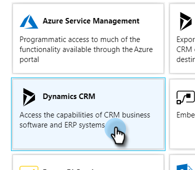
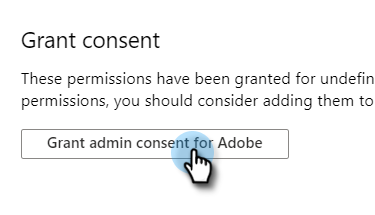

# Registre una aplicación con Azure para adquirir su ID de cliente o ID de aplicación {#register-an-app-with-azure-to-acquire-your-client-id-app-id}

Azure Active Directory extiende sus directorios locales a la nube, proporcionando compatibilidad con MS Dynamics 365 CRM con autenticación ADFS local.

## Registro de una nueva aplicación {#registering-a-new-app}

1. [Iniciar sesión](https://azure.microsoft.com/en-us/account/) al portal de administración de Microsoft Azure mediante una cuenta con permisos de administrador. También puede acceder al portal de Microsoft Azure a través del Centro de administración de Office 365 ampliando el **Administrador** elemento del panel de navegación izquierdo y selección **Azure AD**.

   >[!CAUTION]
   >
   >Debe utilizar una cuenta en la misma suscripción de Office 365 que la que desea registrar la aplicación.

   >[!NOTE]
   >
   >Si no tiene una cuenta de Azure, puede [registrar](https://azure.microsoft.com/en-us/free/) para uno. Consulte la documentación de Microsoft o póngase en contacto con su representante de Microsoft para obtener más información. Una vez creada una cuenta de Azure, puede registrar una o más aplicaciones mediante el procedimiento que se describe a continuación.
   >
   >
   >Si tiene una cuenta de Azure pero la suscripción de Office 365 con Microsoft Dynamics 365 no está disponible en su suscripción de Azure, siga [estas instrucciones](https://msdn.microsoft.com/office/office365/howto/setup-development-environment#bk_CreateAzureSubscription) para asociar las dos cuentas.

1. Busque y haga clic en **Azure Active Directory** en el panel de navegación izquierdo.

   

1. En Administrar, haga clic en **Registros de aplicaciones**.

   

1. Haga clic en **Nuevo registro** en la parte superior de la página.

   

1. Introduzca un nombre para la aplicación, elija el tipo de cuenta aplicable e introduzca una URL de redireccionamiento. A continuación, haga clic en **Registro** en la parte inferior de la página.

   

1. Ahora debería ver su aplicación en la sección **Registros de aplicaciones** pestaña .

   

## Configuración de permisos de aplicaciones {#configuring-app-permissions}

1. En el **Registros de aplicaciones** en Active Directory, haga clic en la aplicación para la que desee configurar los permisos.

   

1. En Administrar, haga clic en **Permisos de API**.

   

1. Haga clic en el **Añadir un permiso** botón.

   

1. Choose **Dynamics CRM**.

   

1. Marque la **Acceso al servicio común de datos como usuario de la organización****s** y haga clic en **Añada permisos.**

   

1. Una vez agregados correctamente los permisos, espere al menos 10 segundos.

   

1. Haga clic en el **Conceder consentimiento de administrador** botón.

   

1. Haga clic en **Sí** para confirmar.

   

   ¡Y ya terminaste!

   
