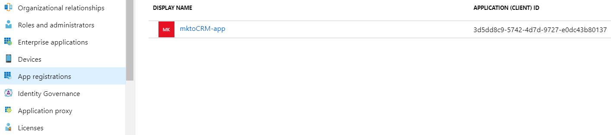

# Registre una aplicación con Azure para adquirir su ID de cliente o ID de aplicación {#register-an-app-with-azure-to-acquire-your-client-id-app-id}

Azure Active Directory amplía los directorios locales en la nube y proporciona compatibilidad con MS Dynamics 365 CRM con autenticación ADFS local.

## Registro de una aplicación nueva {#registering-a-new-app}

1. [Iniciar sesión](https://login.microsoftonline.com/){target="_blank"} al portal de administración de Microsoft Azure con una cuenta con permisos de administrador. También puede acceder al portal de Microsoft Azure a través del Centro de administración de Office 365 si expande el **Administrador** en el panel de navegación izquierdo y seleccione **Azure AD**.

   >[!CAUTION]
   >
   >Debe utilizar una cuenta con la misma suscripción de Office 365 con la que desea registrar la aplicación.

   >[!NOTE]
   >
   >Si no tiene una cuenta de Azure, puede [apuntarse](https://azure.microsoft.com/en-us/free/){target="_blank"} para empezar. Consulte la documentación de Microsoft o póngase en contacto con su representante de Microsoft para obtener más información. Una vez creada una cuenta de Azure, puede registrar una o más aplicaciones mediante el procedimiento que se describe a continuación.
   >
   >
   >Si tiene una cuenta de Azure pero su suscripción de Office 365 con Microsoft Dynamics 365 no está disponible en su suscripción de Azure, siga [estas instrucciones](https://msdn.microsoft.com/office/office365/howto/setup-development-environment#bk_CreateAzureSubscription){target="_blank"} para asociar las dos cuentas.

1. Busque y haga clic en **Azure Active Directory** en el panel de navegación izquierdo.

   

1. En Administrar, haga clic en **Registros de aplicaciones**.

   

1. Clic **Nuevo registro** en la parte superior de la página.

   

1. Escriba un nombre para la aplicación, elija el tipo de cuenta aplicable e introduzca una URL de redireccionamiento. Luego haga clic en **Registrar** en la parte inferior de la página.

   

1. Ahora debería ver su aplicación en la **Registros de aplicaciones** pestaña.

   

## Configuración de permisos de aplicaciones {#configuring-app-permissions}

1. En el **Registros de aplicaciones** en su Active Directory, haga clic en la aplicación para la que desee configurar permisos.

   

1. En Administrar, haga clic en **Permisos de API**.

   

1. Haga clic en **Añadir un permiso** botón.

   

1. Elegir **Dynamics CRM**.

   

1. Compruebe la **Acceso a Common Data Service como usuario **** la organización** y haga clic en **Añada permisos.**

   

1. Una vez que los permisos se hayan agregado correctamente, espere al menos 10 segundos.

   

1. Haga clic en **Conceder consentimiento de administrador** botón.

   

1. Clic **Sí** para confirmar.

   

   ¡Y has terminado!

   
