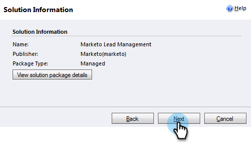

# Paso 1 de 3: Instalación de la solución Marketo (local 2011) {#step-of-install-the-marketo-solution-on-premises}

Para poder sincronizar Microsoft Dynamics On-Premies y Marketo, primero debe instalar la solución Marketo en Dynamics.

>[!NOTE]
>
>Después de sincronizar Marketo con un CRM, no podrá realizar una nueva sincronización sin reemplazar la instancia.

>[!PREREQUISITES]
>
>Debe tener [Implementación de Internet](https://www.microsoft.com/en-us/download/confirmation.aspx?id=41701) (IFD) con [Servicios de federación de Active Directory](https://msdn.microsoft.com/en-us/library/bb897402.aspx) 2.0, 2.1 o 3.0 (ADFS) configurados. **Nota**: El documento IFD se descarga automáticamente al hacer clic en el vínculo.
>
>[Descargar la solución de administración de posibles clientes de Marketo](/help/marketo/product-docs/crm-sync/microsoft-dynamics-sync/sync-setup/download-the-marketo-lead-management-solution.md) antes de comenzar.

>[!NOTE]
>
>**Se requieren permisos de administración de Dynamics.**
>
>Necesita privilegios de administrador de CRM para realizar esta sincronización.

1. Iniciar sesión en **Dynamics**, seleccione **Configuración** en el menú inferior izquierdo.

   

1. Select **Soluciones** en el árbol.

   

1. Haga clic en **Importar**.

   

1. Haga clic en **Examinar**. Seleccione la solución Administración de posibles clientes de Marketo que desee [descargado](/help/marketo/product-docs/crm-sync/microsoft-dynamics-sync/sync-setup/download-the-marketo-lead-management-solution.md). Haga clic en **Siguiente**.

   

1. Consulte la información de la solución y haga clic en **Ver detalles del paquete de soluciones**.

   

1. Cuando haya terminado de comprobar todos los detalles, haga clic en **Cerrar**.

   

1. Vuelva a la página Información de la solución y haga clic en **Siguiente**.

   

1. Asegúrese de que la casilla de verificación de la opción de mensaje SDK esté marcada. Haga clic en **Siguiente**.

   

   >[!TIP]
   >
   >Deberá activar ventanas emergentes en el navegador para completar el proceso de instalación.

1. Ahora espere a que finalice la importación. Levántate y haz algunas estiramientos.

   

1. Haga clic en **Cerrar**.

   >[!NOTE]
   >
   >Puede ver un mensaje que dice &quot;Administración de posibles clientes de Marketo completada con una advertencia&quot;. Esto es totalmente esperado.

   

1. La Administración de posibles clientes de Marketo ahora aparecerá en el **Todas las soluciones** página.

   

1. Seleccione Administración de posibles clientes de Marketo y haga clic en **Publicar todas las personalizaciones.**

   

¿No era malo, verdad? Vamos, seguiré caminando por el resto.

>[!CAUTION]
>
>Si se deshabilita cualquiera de los procesos de mensajería del SDK para Marketo, se dañará la instalación.

>[!MORELIKETHIS]
>
>[Paso 2 de 3: Configuración del usuario de sincronización de Marketo en Dynamics (local de 2011)](/help/marketo/product-docs/crm-sync/microsoft-dynamics-sync/sync-setup/microsoft-dynamics-2011-on-premises/step-2-of-3-set-up.md)
