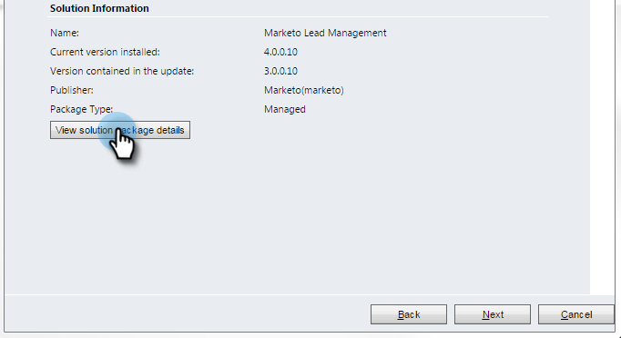

# Paso 1 de 3: Instalar la solución de Marketo en Dynamics (2013 local) {#step-of-install-the-marketo-solution-in-dynamics-on-premises}

Para poder sincronizar Microsoft Dynamics local y Marketo Engage, primero debe instalar la solución Marketo en Dynamics.

>[!NOTE]
>
>Después de sincronizar Marketo con un CRM, no se puede realizar una nueva sincronización sin reemplazar la instancia.

>[!PREREQUISITES]
>
>Debe tener [Implementación con conexión a Internet](https://learn.microsoft.com/en-us/dynamics365/customerengagement/on-premises/deploy/configure-an-internet-facing-deployment){target="_blank"} (IFD) con [Servicios de federación de Active Directory](https://msdn.microsoft.com/en-us/library/bb897402.aspx){target="_blank"} 2.0, 2.1 o 3.0 (ADFS) configurados. Nota: El documento IFD se descarga automáticamente al hacer clic en el vínculo.
>
>[Descargue la solución Marketo](/help/marketo/product-docs/crm-sync/microsoft-dynamics-sync/sync-setup/download-the-marketo-lead-management-solution.md){target="_blank"} antes de comenzar.

>[!NOTE]
>
>**Se requieren permisos de administración de Dynamics**.
>
>Necesita privilegios de administrador de CRM para realizar esta sincronización.

1. Inicie sesión en Dynamics. Haga clic en el menú desplegable **[!UICONTROL Microsoft Dynamics CRM]** y seleccione **[!UICONTROL Configuración]**.

   

1. En **[!UICONTROL Configuración]**, seleccione **[!UICONTROL Soluciones]**.

   

1. Haga clic en **[!UICONTROL Importar]**.

   

1. Haga clic en **[!UICONTROL Examinar]** y seleccione la [solución descargada](/help/marketo/product-docs/crm-sync/microsoft-dynamics-sync/sync-setup/download-the-marketo-lead-management-solution.md){target="_blank"}. Haga clic en **[!UICONTROL Siguiente]**.

   

1. Vea la información de la solución y haga clic en **[!UICONTROL Ver detalles del paquete de la solución]**.

   

1. Cuando termine de comprobar todos los detalles, haga clic en **[!UICONTROL Cerrar]**.

   

1. Vuelva a la página Información de la solución y haga clic en **[!UICONTROL Siguiente]**.

   

1. Asegúrese de que la opción SDK esté seleccionada. Haga clic en **[!UICONTROL Importar]**.

   

1. Espere a que finalice la importación.

   >[!TIP]
   >
   >Deberá habilitar las ventanas emergentes en el explorador para completar el proceso de instalación.

   

1. Descargue un archivo de registro (si lo desea) y haga clic en **[!UICONTROL Cerrar]**.

   >[!NOTE]
   >
   >Puede ver un mensaje que dice &quot;Marketo Lead Management completado con advertencia&quot;. Esto es totalmente esperado.

   

1. Marketo Lead Management aparecerá en la página **[!UICONTROL Todas las soluciones]**.

   

1. Seleccione la solución Marketo y haga clic en **[!UICONTROL Publicar todas las personalizaciones]**.

   

>[!CAUTION]
>
>Si deshabilita cualquiera de los procesos de mensajería de Marketo SDK, se producirá un error en la instalación.

>[!MORELIKETHIS]
>
>[Paso 2 de 3: Configuración de la sincronización del usuario para Marketo (2013 local)](/help/marketo/product-docs/crm-sync/microsoft-dynamics-sync/sync-setup/connecting-to-legacy-versions/step-2-of-3-configure-2013.md){target="_blank"}
