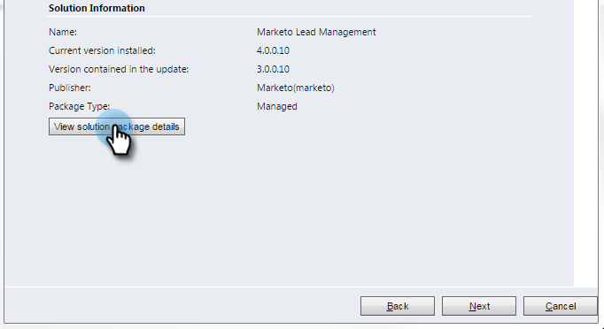

# Paso 1 de 3: Configuración de la sincronización del usuario para Marketo (2015 local) {#step-of-configure-sync-user-for-marketo-on-premises-2015}

Para poder sincronizar [!DNL Microsoft Dynamics] 2015 local con Marketo, primero debe instalar la solución Marketo en [!DNL Dynamics].

>[!NOTE]
>
>Después de sincronizar Marketo con un CRM, no se puede sincronizar un nuevo CRM con la instancia de Marketo existente.

>[!PREREQUISITES]
>
>Si usa [!DNL Microsoft Dynamics] On-Premise, debe tener [Implementación con conexión a Internet](https://www.microsoft.com/en-us/download/confirmation.aspx?id=41701) (IFD) con [Servicios de federación de Active Directory](https://msdn.microsoft.com/en-us/library/bb897402.aspx) 2.0+ (ADFS) configurado. Nota: El documento IFD se descarga automáticamente al hacer clic en el vínculo.
>
>[Descargue Marketo Lead Management Solution](/help/marketo/product-docs/crm-sync/microsoft-dynamics-sync/sync-setup/download-the-marketo-lead-management-solution.md){target="_blank"} antes de comenzar.

>[!NOTE]
>
>**Se requieren permisos de administración de Dynamics**.
>
>Necesita privilegios de administrador de CRM para realizar esta sincronización.

1. Inicie sesión en **[!DNL Dynamics].** Haz clic en el menú desplegable **[!UICONTROL Microsoft Dynamics CRM]** y selecciona **[!UICONTROL Configuración]**.

   

1. En **[!UICONTROL Configuración]**, seleccione **[!UICONTROL Soluciones]**.

   

1. Haga clic en **[!UICONTROL Importar]**.

   

1. Haga clic en **[!UICONTROL Examinar]** y seleccione la solución que [descargó](/help/marketo/product-docs/crm-sync/microsoft-dynamics-sync/sync-setup/download-the-marketo-lead-management-solution.md). Haga clic en **[!UICONTROL Siguiente]**.

   

1. Vea la [!UICONTROL información de la solución] y haga clic en **[!UICONTROL Ver detalles del paquete de la solución]**.

   

1. Cuando termine de comprobar todos los detalles, haga clic en **[!UICONTROL Cerrar]**.

   

1. Vuelva a la página [!UICONTROL Información de la solución] y haga clic en **[!UICONTROL Siguiente]**.

   

1. Asegúrese de que la casilla de verificación de la opción SDK esté seleccionada. Haga clic en **[!UICONTROL Importar]**.

   

1. Espere a que finalice la importación.

   >[!TIP]
   >
   >Deberá habilitar las ventanas emergentes en el explorador para completar el proceso de instalación.

   

1. Descargue un archivo de registro (si lo desea) y haga clic en **[!UICONTROL Cerrar]**.

   >[!NOTE]
   >
   >Puede ver un mensaje que dice &quot;Marketo Lead Management completado con advertencia&quot;. Esto es totalmente esperado.

   

1. Marketo Lead Management aparecerá en la página **[!UICONTROL Todas las soluciones]**.

   

1. Seleccione la solución Marketo y haga clic en **[!UICONTROL Publicar todas las personalizaciones]**.

   

   ¡Buen trabajo! La instalación ha finalizado.

   >[!CAUTION]
   >
   >Si deshabilita cualquiera de los procesos de mensajería de Marketo SDK, se producirá un error en la instalación.

   >[!MORELIKETHIS]
   >
   >[Instalar Marketo para [!DNL Microsoft Dynamics] 2015: paso 2 de 3](/help/marketo/product-docs/crm-sync/microsoft-dynamics-sync/sync-setup/connecting-to-legacy-versions/step-2-of-3-set-up-2015.md) local
