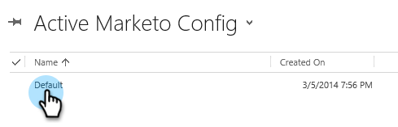

# Paso 2 de 3: Configuración de la sincronización de usuarios con Marketo (2013 local) {#step-of-configure-sync-user-for-marketo-on-premises}

Buen trabajo completando los pasos anteriores, sigamos con esto.

>[!PREREQUISITES]
>
>[Paso 1 de 3: Instalar la solución de Marketo en Dynamics (2013 local)](/help/marketo/product-docs/crm-sync/microsoft-dynamics-sync/sync-setup/connecting-to-legacy-versions/step-1-of-3-install-2013.md){target="_blank"}

## Asignar función de usuario de sincronización {#assign-sync-user-role}

Asigne la función Usuario de sincronización de Marketo únicamente al usuario de sincronización de Marketo. No es necesario asignarlo a ningún otro usuario.

>[!NOTE]
>
>Esto se aplica al complemento de Marketo versión 4.0.0.14 y posteriores. Para las versiones anteriores, todos los usuarios deben tener la función de usuario de sincronización. Para actualizar Marketo, consulte [Actualizar la solución de Marketo para Microsoft Dynamics](/help/marketo/product-docs/crm-sync/microsoft-dynamics-sync/sync-setup/update-the-marketo-solution-for-microsoft-dynamics.md){target="_blank"}.

>[!IMPORTANT]
>
>La configuración de idioma del usuario de sincronización [debe establecerse en inglés](https://portal.dynamics365support.com/knowledgebase/article/KA-01201/en-us){target="_blank"}.

1. En **Configuración**, haga clic en **Administration**.

   

1. Seleccionar **Usuarios**.

   

1. Aquí verá una lista de usuarios. Seleccione al usuario de Marketo Sync o póngase en contacto con su [Servicios de federación de Active Directory (AFDS)](https://msdn.microsoft.com/en-us/library/bb897402.aspx){target="_blank"} administrator to create a new user that's [dedicated to Marketo](https://blogs.technet.com/b/askpfeplat/archive/2014/04/21/introduction-to-active-directory-federation-services-ad-fs-alternateloginid-feature.aspx){target="_blank"}.

   

1. Seleccione el usuario de sincronización. Clic  y seleccione **[!UICONTROL Administrar funciones]**.

   

1. Marque **[!UICONTROL Usuario de sincronización de Marketo]** y haga clic en **[!UICONTROL OK]**.

   

   >[!TIP]
   >
   >Si no ve la función, vuelva a [paso 1 de 3](/help/marketo/product-docs/crm-sync/microsoft-dynamics-sync/sync-setup/connecting-to-legacy-versions/step-1-of-3-install-2013.md){target="_blank"} e importe la solución.

   >[!NOTE]
   >
   >Cualquier actualización realizada en su CRM por el usuario de sincronización _no_ se sincronizarán de nuevo con Marketo.

## Configuración de la solución Marketo {#configure-marketo-solution}

¡Ya casi terminamos! Solo tenemos unas pocas piezas de configuración antes de pasar al siguiente artículo.

1. En **[!UICONTROL Configuración]**, haga clic en **[!UICONTROL Configuración de Marketo]**.

   

   >[!NOTE]
   >
   >Si falta &quot;Configuración de Marketo&quot;, intente actualizar la página. Si el problema persiste, [publicación de la solución Marketo](/help/marketo/product-docs/crm-sync/microsoft-dynamics-sync/sync-setup/connecting-to-legacy-versions/step-1-of-3-install-2013.md) de nuevo o intente cerrar la sesión y volver a iniciarla.

1. Clic **[!UICONTROL Predeterminado]**.

   

1. Haga clic en **[!UICONTROL Usuario de Marketo]** y seleccione el usuario sync.

   

1. Clic  en la esquina inferior derecha para guardar los cambios.

   

1. Clic **[!UICONTROL Publicar todas las personalizaciones]**.

   

## Antes de continuar con el paso 3 {#before-proceeding-to-step}

* Si desea restringir el número de registros que sincroniza, [configuración de un filtro de sincronización personalizado](/help/marketo/product-docs/crm-sync/microsoft-dynamics-sync/create-a-custom-dynamics-sync-filter.md){target="_blank"} ahora.
* Ejecute el [Validar sincronización de Microsoft Dynamics](/help/marketo/product-docs/crm-sync/microsoft-dynamics-sync/sync-setup/validate-microsoft-dynamics-sync.md){target="_blank"} proceso. Comprueba que las configuraciones iniciales se hayan realizado correctamente.
* Inicie sesión en el usuario de sincronización de Marketo en Microsoft Dynamics CRM.

¡Buen trabajo! 

>[!MORELIKETHIS]
>
>[Paso 3 de 3: Conexión de Marketo y Dynamics (2013 local)](/help/marketo/product-docs/crm-sync/microsoft-dynamics-sync/sync-setup/connecting-to-legacy-versions/step-3-of-3-connect-2013.md){target="_blank"}
