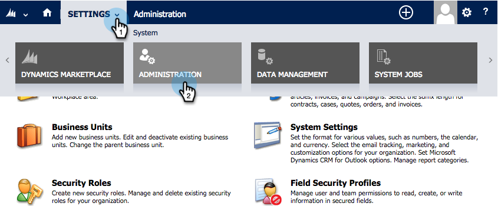
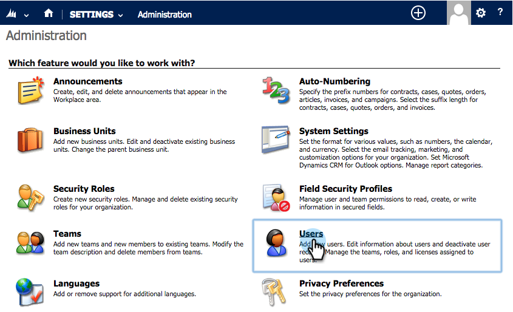
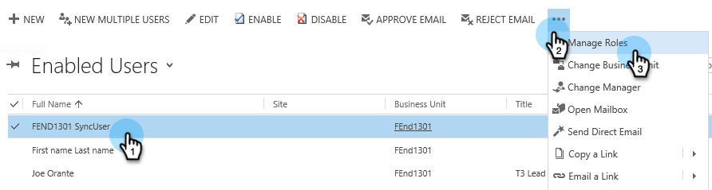
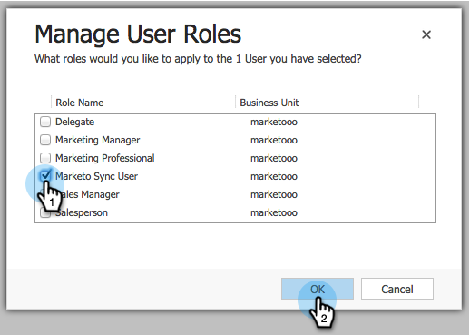
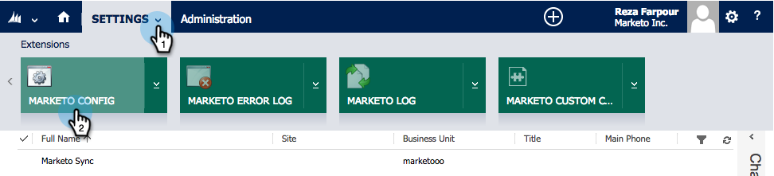
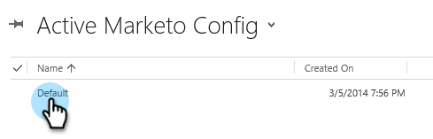
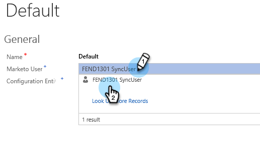
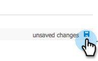

# Paso 2 de 3: Configuración de la sincronización de usuarios con Marketo (2013, local) {#step-of-configure-sync-user-for-marketo-on-premises}

Los pasos anteriores se han completado.

>[!PREREQUISITES]
>
>[Paso 1 de 3: Instalar la solución de Marketo en [!DNL Dynamics] (2013 local)](/help/marketo/product-docs/crm-sync/microsoft-dynamics-sync/sync-setup/connecting-to-legacy-versions/step-1-of-3-install-2013.md)

## Asignar función de usuario de sincronización {#assign-sync-user-role}

Asigne la función Usuario de sincronización de Marketo únicamente al usuario de sincronización de Marketo. No es necesario asignarlo a ningún otro usuario.

>[!NOTE]
>
>Esto se aplica a la versión del complemento de Marketo 4.0.0.14 y posterior. Para las versiones anteriores, todos los usuarios deben tener la función de usuario de sincronización. Para actualizar Marketo, consulte [Actualizar la solución Marketo para [!DNL Microsoft Dynamics]](/help/marketo/product-docs/crm-sync/microsoft-dynamics-sync/sync-setup/update-the-marketo-solution-for-microsoft-dynamics.md).

>[!IMPORTANT]
>
>La configuración de idioma del usuario de sincronización [&#x200B; debe establecerse en inglés](https://learn.microsoft.com/en-us/power-platform/admin/enable-languages){target="_blank"}.

1. En **[!UICONTROL Configuración]**, haga clic en **[!UICONTROL Administración]**.

   

1. Seleccione **[!UICONTROL Usuarios]**.

   

1. Aquí verá una lista de usuarios. Seleccione al usuario de sincronización de Marketo o póngase en contacto con el administrador de [Servicios de federación de Active Directory (AFDS)](https://msdn.microsoft.com/en-us/library/bb897402.aspx){target="_blank"} para crear un nuevo usuario [dedicado a Marketo](https://blogs.technet.com/b/askpfeplat/archive/2014/04/21/introduction-to-active-directory-federation-services-ad-fs-alternateloginid-feature.aspx){target="_blank"}.

   

1. Seleccione el usuario de sincronización. Haga clic en  y seleccione **[!UICONTROL Administrar roles]**

   

1. Comprueba **[!UICONTROL el usuario de sincronización de Marketo]** y haz clic en **[!UICONTROL Aceptar]**.

   

   >[!TIP]
   >
   >Si no ve la función, vuelva al [paso 1 de 3](/help/marketo/product-docs/crm-sync/microsoft-dynamics-sync/sync-setup/connecting-to-legacy-versions/step-1-of-3-install-2013.md){target="_blank"} e importe la solución.

   >[!NOTE]
   >
   >Cualquier actualización hecha en su CRM por el usuario de sincronización _no_ se sincronizará de nuevo con Marketo.

## Configuración de la solución Marketo {#configure-marketo-solution}

Quedan algunas partes finales de la configuración antes de pasar al siguiente artículo.

1. En **[!UICONTROL Configuración]**, haga clic en **[!UICONTROL Configuración de Marketo]**.

   

   >[!NOTE]
   >
   >Si falta la configuración de **[!UICONTROL Marketo]**, intente actualizar la página. Si el problema persiste, [vuelva a publicar la solución de Marketo](/help/marketo/product-docs/crm-sync/microsoft-dynamics-sync/sync-setup/connecting-to-legacy-versions/step-1-of-3-install-2013.md) o intente cerrar la sesión y volver a iniciarla.

1. Haga clic en **[!UICONTROL Predeterminado]**.

   

1. Haga clic en el campo **[!UICONTROL Usuario de Marketo]** y seleccione el usuario de sincronización.

   

1. Haga clic en  en la esquina inferior derecha para guardar los cambios.

   

1. Haga clic en **[!UICONTROL Publicar todas las personalizaciones]**.

   

## Antes de continuar con el paso 3 {#before-proceeding-to-step}

* Si desea restringir el número de registros que sincroniza, [configure ahora un filtro de sincronización personalizado](/help/marketo/product-docs/crm-sync/microsoft-dynamics-sync/create-a-custom-dynamics-sync-filter.md).
* Ejecute el proceso [Validar [!DNL Microsoft Dynamics] Sincronizar](/help/marketo/product-docs/crm-sync/microsoft-dynamics-sync/sync-setup/validate-microsoft-dynamics-sync.md). Comprueba que las configuraciones iniciales se hayan realizado correctamente.
* Inicie sesión en el usuario de sincronización de Marketo en [!DNL Microsoft Dynamics] CRM.

>[!MORELIKETHIS]
>
>[Paso 3 de 3: conectar Marketo y [!DNL Dynamics] (2013 local)](/help/marketo/product-docs/crm-sync/microsoft-dynamics-sync/sync-setup/connecting-to-legacy-versions/step-3-of-3-connect-2013.md)
