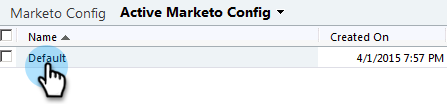

# Paso 2 de 3: Configuración del usuario de sincronización de Marketo en Dynamics (local de 2011) {#step-of-set-up-marketo-sync-user-in-dynamics-on-premises}

Bueno trabajo completando los pasos anteriores, sigamos adelante con esto.

>[!PREREQUISITES]
>
>[Paso 1 de 3: Instalación de la solución Marketo (local 2011)](/help/marketo/product-docs/crm-sync/microsoft-dynamics-sync/sync-setup/connecting-to-legacy-versions/step-1-of-3-install-2011.md)

## Asignar función de usuario de sincronización {#assign-sync-user-role}

Asigne la función de usuario de sincronización de Marketo únicamente al usuario de sincronización de Marketo. No es necesario asignarlo a ningún otro usuario.

>[!NOTE]
>
>Esto se aplica al complemento de Marketo versión 4.0.0.14 y posteriores. En versiones anteriores, todos los usuarios deben tener la función de sincronización de usuarios. Para actualizar Marketo, consulte [Actualización de la solución Marketo para Microsoft Dynamics](/help/marketo/product-docs/crm-sync/microsoft-dynamics-sync/sync-setup/update-the-marketo-solution-for-microsoft-dynamics.md).

>[!IMPORTANT]
>
>La configuración de idioma del usuario de sincronización [debe establecerse en inglés](https://portal.dynamics365support.com/knowledgebase/article/KA-01201/en-us).

1. En el menú inferior izquierdo, seleccione **Configuración**.

   

1. En el árbol, seleccione **Administración**.

   

1. Select **Usuarios**.

   

1. Aquí puede ver una lista de usuarios. Seleccione el usuario de sincronización de Marketo o póngase en contacto con su [Servicios de federación de Active Directory (AFDS)](https://msdn.microsoft.com/en-us/library/bb897402.aspx) para crear un nuevo usuario dedicado a Marketo. Haga clic en **Administrar funciones**.

   

1. Marque **Usuario de sincronización de Marketo** y haga clic en **OK**.

   

   >[!TIP]
   >
   >Si no ve la función , vuelva a [paso 1 de 3](/help/marketo/product-docs/crm-sync/microsoft-dynamics-sync/sync-setup/microsoft-dynamics-2011-on-premises/step-1-of-3-install.md) e importe la solución.

   >[!NOTE]
   >
   >Cualquier actualización realizada en su CRM por el usuario de sincronización **not** se sincronizan de nuevo con Marketo.

## Configurar la solución Marketo {#configure-marketo-solution}

¡Casi terminado! Solo tenemos algunos últimos fragmentos de configuración antes de pasar al siguiente artículo.

1. Select **Configuración**. A continuación, seleccione **Configuración de Marketo** en el árbol.

   

   >[!NOTE]
   >
   >Si falta la configuración de Marketo, intente actualizar la página. Si el problema persiste, [volver a publicar la solución de Marketo](/help/marketo/product-docs/crm-sync/microsoft-dynamics-sync/sync-setup/microsoft-dynamics-2011-on-premises/step-1-of-3-install.md) o cierre la sesión y vuelva a iniciarla.

1. Haga clic en **Predeterminado**.

   

1. Haga clic en 

   

1. En la ventana emergente, seleccione el usuario de sincronización. A continuación, haga clic en **OK**.

   

1. Haga clic en **Guardar** para guardar los cambios.

   

1. Haga clic en **Publicar todas las personalizaciones**.

   

## Antes de continuar con el paso 3 {#before-proceeding-to-step}

    * Si desea restringir el número de registros que sincroniza, [configure un filtro de sincronización personalizado](/help/marketo/product-docs/crm-sync/microsoft-dynamics-sync/create-a-custom-dynamics-sync-filter.md) ahora.
    * Ejecute el proceso [Validar sincronización de Microsoft Dynamics](/help/marketo/product-docs/crm-sync/microsoft-dynamics-sync/sync-setup/validate-microsoft-dynamics-sync.md). Comprueba que la configuración inicial se haya realizado correctamente.
    * Inicie sesión en el usuario de sincronización de Marketo en Microsoft Dynamics CRM.

¡bueno trabajo!

>[!MORELIKETHIS]
>
>[Paso 3 de 3: Conectar Microsoft Dynamics con Marketo (local de 2011)](/help/marketo/product-docs/crm-sync/microsoft-dynamics-sync/sync-setup/microsoft-dynamics-2011-on-premises/step-3-of-3-connect.md)
