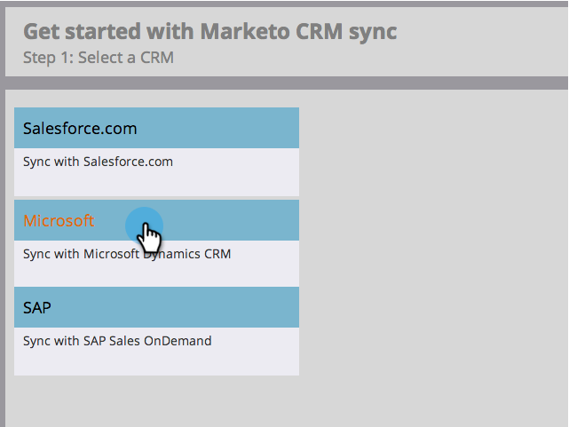

# Paso 3 de 3: Conectar Microsoft Dynamics con Marketo (local de 2011) {#step-of-connect-microsoft-dynamics-with-marketo-on-premises}

¡Bien! Hemos instalado la solución y configurado el usuario de sincronización. A continuación, es necesario conectar Marketo y Dynamics.

>[!PREREQUISITES]
>
>* [Paso 1 de 3: Instalación de la solución Marketo (local 2011)](/help/marketo/product-docs/crm-sync/microsoft-dynamics-sync/sync-setup/microsoft-dynamics-2011-on-premises/step-1-of-3-install.md)
>* [Paso 2 de 3: Configuración del usuario de sincronización de Marketo en Dynamics (local de 2011)](/help/marketo/product-docs/crm-sync/microsoft-dynamics-sync/sync-setup/microsoft-dynamics-2011-on-premises/step-2-of-3-set-up.md)

>[!NOTE]
>
>**Se requieren permisos de administrador**

## Introducir información del usuario de Dynamics Sync {#enter-dynamics-sync-user-information}

1. Inicie sesión en Marketo y haga clic en **Administrador**.

   

1. Haga clic en **CRM**.

   

1. Haga clic en **Microsoft**.

   

1. Haga clic en **Editar** en **Paso 1: Escriba las credenciales.**

   

   >[!CAUTION]
   >
   >Asegúrese de que sus credenciales sean correctas, ya que no podemos revertir los cambios de esquema posteriores después del envío. Si se guardan credenciales incorrectas, deberá obtener una nueva suscripción a Marketo.

1. Introduzca la variable **Nombre de usuario**, **Contraseña** y CRM **URL** a continuación, haga clic en **Guardar**.

   

   >[!NOTE]
   >
   >* El nombre de usuario en Marketo debe coincidir con el nombre de usuario para sincronizar el usuario en CRM. El formato puede ser `user@domain.com` o DOMINIO\usuario.
   >* Si no conoce la dirección URL, [aprenda a encontrarlo aquí](/help/marketo/product-docs/crm-sync/microsoft-dynamics-sync/sync-setup/view-the-organization-service-url.md).

## Seleccionar campos para sincronizar {#select-fields-to-sync}

Ahora necesitamos seleccionar los campos que queremos sincronizar.

1. Haga clic en **Editar** en **Paso 2: Seleccione Campos para sincronizar.**

   

1. Hay campos preseleccionados que se sincronizarán. Añada más si lo desea y haga clic en **Guardar**.

   

   >[!NOTE]
   >
   >Marketo almacena una referencia a los campos que se van a sincronizar. Si elimina un campo en Dynamics, se recomienda hacerlo con la variable [sincronizar desactivado](/help/marketo/product-docs/crm-sync/salesforce-sync/enable-disable-the-salesforce-sync.md). A continuación, actualice el esquema en Marketo editando y guardando el [Seleccionar campos para sincronizar](/help/marketo/product-docs/crm-sync/microsoft-dynamics-sync/microsoft-dynamics-sync-details/microsoft-dynamics-sync-field-sync/editing-fields-to-sync-before-deleting-them-in-dynamics.md).

## Campos de sincronización para un filtro personalizado {#sync-fields-for-a-custom-filter}

Si ha creado un filtro personalizado, asegúrese de entrar y seleccionar los nuevos campos que desea sincronizar con Marketo.

1. Vaya a Administración y seleccione **Microsoft Dynamics**.

   

1. Haga clic en **Editar** en Detalles de sincronización de campos.

   

1. Desplácese hacia abajo hasta el campo y compruébelo. El nombre real debe ser new_synctomkto, pero el Nombre para mostrar puede ser cualquier cosa. Haga clic en **Guardar**.

   

## Habilitar sincronización {#enable-sync}

1. Haga clic en **Editar** en **Paso 3: Habilitar sincronización**.

   

   >[!CAUTION]
   >
   >Marketo no desduplicará automáticamente con una sincronización de Microsoft Dynamics o cuando introduzca manualmente personas o posibles clientes.

1. Lea todo en la ventana emergente, introduzca su correo electrónico y haga clic en **Iniciar sincronización**.

   

1. La primera sincronización puede tardar unas horas. Una vez finalizado, recibirá una notificación por correo electrónico.

   

   ¡Excelente trabajo!
