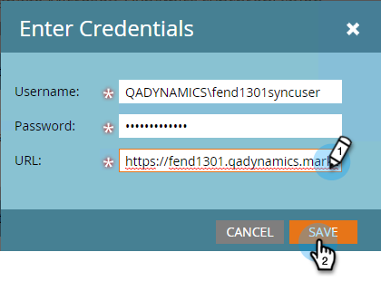
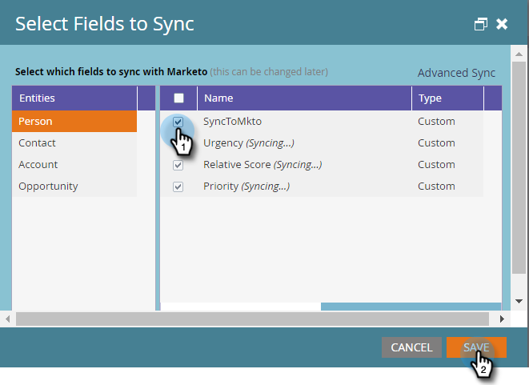

# Paso 3 de 3: Conectar Marketo y [!DNL Dynamics] (2013 local) {#step-of-connect-marketo-and-dynamics-on-premises}

La solución se instala y se configura el usuario de sincronización. A continuación, conecte Marketo y [!DNL Dynamics].

>[!PREREQUISITES]
>
>* [Paso 1 de 3: Instalar la solución de Marketo en [!DNL Dynamics] (2013 local)](/help/marketo/product-docs/crm-sync/microsoft-dynamics-sync/sync-setup/connecting-to-legacy-versions/step-1-of-3-install-2013.md)
>* [Paso 2 de 3: Configuración de la sincronización del usuario para Marketo (2013 local)](/help/marketo/product-docs/crm-sync/microsoft-dynamics-sync/sync-setup/connecting-to-legacy-versions/step-2-of-3-configure-2013.md)

>[!NOTE]
>
>**Se requieren permisos de administrador**

## Escriba la información de usuario de sincronización [!DNL Dynamics] {#enter-dynamics-sync-user-information}

1. Inicie sesión en Marketo y haga clic en **[!UICONTROL Administrador]**.

   

1. Haz clic en **[!UICONTROL CRM]**.

   

1. Seleccione **[!DNL Microsoft]**.

   

1. Haga clic en **[!UICONTROL Editar]** en **[!UICONTROL Paso 1: Escriba las credenciales]**.

   

   >[!CAUTION]
   >
   >Compruebe que sus credenciales son correctas. Los cambios de esquema posteriores no se pueden revertir después del envío. Si se guardan credenciales incorrectas, se requerirá una nueva suscripción de Marketo.

1. Escriba **[!UICONTROL Nombre de usuario]**, **[!UICONTROL Contraseña]** y [!DNL Microsoft Dynamics] **URL** y, a continuación, haga clic en **[!UICONTROL Guardar]**.

   

   >[!NOTE]
   >
   >* El Nombre de usuario en Marketo debe coincidir con el Nombre de usuario para el usuario de sincronización en CRM. El formato puede ser `user@domain.com` o DOMAIN\user.
   >* Si no conoce la dirección URL, [aprenda a encontrarla aquí](/help/marketo/product-docs/crm-sync/microsoft-dynamics-sync/sync-setup/view-the-organization-service-url.md){target="_blank"}.

## Seleccionar campos para sincronización {#select-fields-to-sync}

Seleccione los campos que desea sincronizar.

1. Haga clic en **[!UICONTROL Editar]** en **[!UICONTROL Paso 2: Seleccionar campos para sincronizar]**.

   

1. Seleccione los campos que desea sincronizar con Marketo para que se preseleccionen. Haga clic en **[!UICONTROL Guardar]**.

   

   >[!NOTE]
   >
   >Marketo almacena una referencia a los campos que se van a sincronizar. Si elimina un campo de [!DNL Dynamics], se recomienda hacerlo con la [sincronización deshabilitada](/help/marketo/product-docs/crm-sync/salesforce-sync/enable-disable-the-salesforce-sync.md). A continuación, actualice el esquema en Marketo editando y guardando [[!UICONTROL Seleccionar campos para sincronizar]](/help/marketo/product-docs/crm-sync/microsoft-dynamics-sync/microsoft-dynamics-sync-details/microsoft-dynamics-sync-field-sync/editing-fields-to-sync-before-deleting-them-in-dynamics.md).

## Sincronizar campos para un filtro personalizado {#sync-fields-for-a-custom-filter}

Si ha creado un filtro personalizado, vaya y seleccione los nuevos campos que desea sincronizar con Marketo.

1. Vaya a [!UICONTROL Admin] y seleccione **[!UICONTROL Microsoft Dynamics]**.

   

1. Haz clic en **[!UICONTROL Editar]** en [!UICONTROL Detalles de sincronización de campos].

   

1. Desplácese hacia abajo hasta el campo y compruébelo. El nombre real debe ser new_synctomkto, pero el Nombre para mostrar puede ser cualquier cosa. Haga clic en **[!UICONTROL Guardar]**.

   

## Habilitar sincronización {#enable-sync}

1. Haga clic en **[!UICONTROL Editar]** en **[!UICONTROL Paso 3: Habilitar sincronización]**.

   

   >[!CAUTION]
   >
   >Marketo no desduplicará automáticamente una sincronización de [!DNL Microsoft Dynamics] ni cuando se introduzcan manualmente personas o posibles clientes.

1. Lee todo en la ventana emergente, escribe tu correo electrónico y haz clic en **[!UICONTROL Iniciar sincronización]**.

   

1. Según el número de registros, la sincronización inicial puede tardar entre unas horas y unos días. Recibirá una notificación por correo electrónico una vez completada.

   

Ya está configurada la sincronización bidireccional entre Marketo y [!DNL Microsoft Dynamics]. Si ha comprado [!DNL Marketo Sales Insight], vea lo siguiente:

>[!MORELIKETHIS]
>
>[Instalar y configurar [!DNL Marketo Sales Insight] en [!DNL Microsoft Dynamics] 2013](/help/marketo/product-docs/marketo-sales-insight/msi-for-microsoft-dynamics/installing/install-and-configure-marketo-sales-insight-in-microsoft-dynamics-2013.md)
