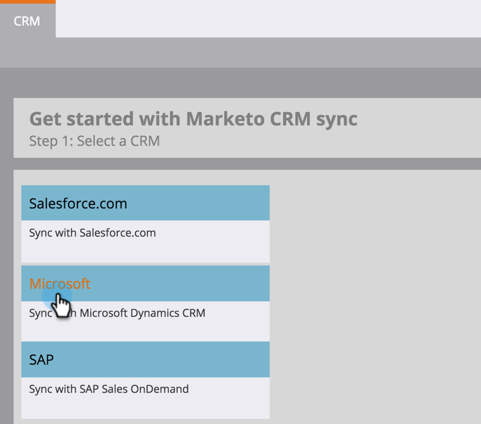

# Descargar la solución Marketo Lead Management {#download-the-marketo-lead-management-solution}

>[!NOTE]
>
>**Permisos de administración necesarios**

Para comenzar la sincronización, deberá descargar e instalar una solución de Marketo en su cuenta de Microsoft Dynamics.

>[!CAUTION]
>
>Es imprescindible descargar la última solución de Marketo _antes_ realizar cualquier actualización.

>[!NOTE]
>
>Marketo solo admite certificados SSL compatibles con Java 7 en este momento.

1. Vaya a la **Administrador** área.

   

1. Haga clic en **CRM**.

   

1. Seleccionar **Microsoft**.

   

1. Seleccionar **Descargar solución de Marketo**.

   

1. Seleccione la solución adecuada para su versión de Microsoft Dynamics.

   

¡Increíble! Ahora se descargará un archivo zip de la solución en el dispositivo.
