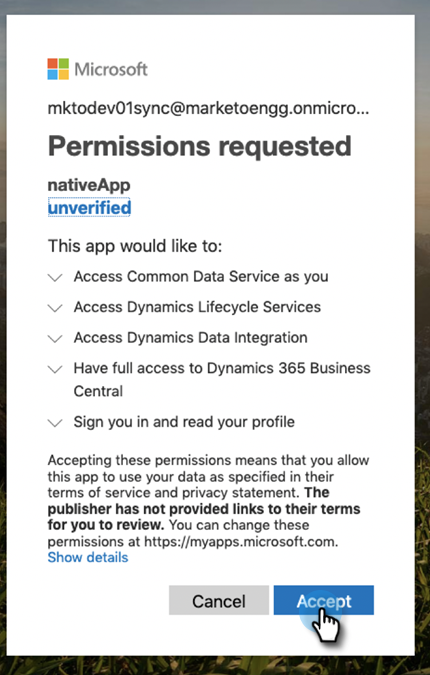

# Conceder consentimiento para el ID de cliente y el registro de aplicaciones {#grant-consent-for-client-id-and-app-registration}

## Conceder permisos de usuario delegados para el usuario de sincronización {#grant-delegated-user-permissions-for-the-sync-user}

1. Utilice un programa de texto limpio (Bloc de notas para Windows, Edición de texto para Mac) para crear un identificador uniforme de recursos (URI) para la autorización pegando el texto siguiente y sustituyendo los valores client_id, redirect_uri y state.

   ```
   https://login.microsoftonline.com/common/oauth2/authorize?
   client_id='xxxxxx-xxxx-xxxx-xxxx-xxxxxxxx'
   &response_type='code'
   &redirect_uri='https://www.<ourdomain>.com'
   &response_mode='query'
   &state='SOME_UNIQUE_UID'
   client_id value should be the client_id generated in App Registration process
   redirect_uri value should be same as value entered at the time of App registration-> Redirect URIs
   state value can be any ID (e.g.,12345)
   ```

   <table> 
    <colgroup> 
     <col> 
     <col> 
    </colgroup> 
    <tbody> 
     <tr> 
      <td><strong>valor client_id</strong></td> 
      <td>debe ser el client_id generado en el proceso de registro de la aplicación</td> 
     </tr> 
     <tr> 
      <td><strong>valor redirect_uri</strong></td> 
      <td>debe ser el mismo valor introducido al registrar la aplicación &gt; Redirigir URI</td> 
     </tr> 
     <tr> 
      <td><strong>valor de estado</strong></td> 
      <td>puede ser cualquier ID (por ejemplo, 12345)</td> 
     </tr> 
    </tbody> 
   </table>

   La dirección URL final debe tener un aspecto similar al siguiente: `https://login.microsoftonline.com/common/oauth2/authorize?client_id=xxxxxx-xxxx-xxxx-xxxx-xxxxxxxx&response_type=code&redirect_uri=https://www.marketo.com&response_mode=query&state=12345`

1. Abra el URI que creó en cualquier explorador.

   

1. Inicie sesión como el usuario de sincronización para el que concede permisos.

   

   >[!NOTE]
   >
   >Si ya ha iniciado sesión en Azure como administrador en otra pestaña, deberá utilizar un explorador diferente o un modo de incógnito para iniciar sesión como usuario de sincronización.

1. Clic **Aceptar**.

   

## Conceder consentimiento a todos los usuarios {#grant-consent-for-all-users}

Como administrador, también puede dar su consentimiento a los permisos delegados de una aplicación en nombre de todos los usuarios de su inquilino. El consentimiento administrativo evita que aparezca el cuadro de diálogo de consentimiento para cada usuario del inquilino, y los usuarios con la función de administrador pueden hacerlo en el portal de Azure. Descubra qué funciones de administrador pueden [consentimiento para permisos delegados aquí](https://docs.microsoft.com/en-us/azure/active-directory/roles/permissions-reference).

1. En el portal de Azure, vaya a la página principal de la aplicación.

1. En Administrar, haga clic en **Permisos de API**.

   

1. Haga clic en **Conceder consentimiento de administrador** botón (para inquilino).

   

1. Clic **Sí** para confirmar.

   

