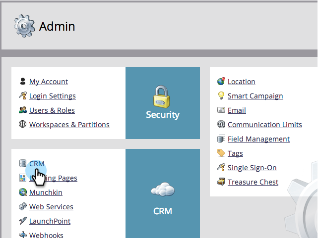

# Paso 3 de 3: Conectar Marketo y Dynamics (On-Premies 2013) {#step-of-connect-marketo-and-dynamics-on-premises}

¡Bien! Hemos instalado la solución y configurado el usuario de sincronización. A continuación, es necesario conectar Marketo y Dynamics.

>[!PREREQUISITES]
>
>* [Paso 1 de 3: Instalación de la solución Marketo en Dynamics (local 2013)](/help/marketo/product-docs/crm-sync/microsoft-dynamics-sync/sync-setup/microsoft-dynamics-2013-on-premises/step-1-of-3-install.md)
>* [Paso 2 de 3: Configuración del usuario de sincronización para Marketo (locales de 2013)](/help/marketo/product-docs/crm-sync/microsoft-dynamics-sync/sync-setup/microsoft-dynamics-2013-on-premises/step-2-of-3-configure.md)

>[!NOTE]
>
>**Se requieren permisos de administrador**

## Escriba la información de usuario de Dynamics Sync {#enter-dynamics-sync-user-information}

1. Inicie sesión en Marketo y haga clic en **Admin**.

   

1. Haga clic en **CRM**.

   

1. Seleccione **Microsoft**.

   

1. Haga clic en **Editar** en **Paso 1: Escriba Credentials**.

   

   >[!CAUTION]
   >
   >Asegúrese de que sus credenciales sean correctas, ya que no podemos revertir los cambios de esquema posteriores después del envío. Si se guardan credenciales incorrectas, deberá obtener una nueva suscripción a Marketo.

1. Introduzca **Nombre de usuario**, **Contraseña** y Microsoft Dynamics **URL** y haga clic en **Guardar**.

   

   >[!NOTE]
   >
   >* El nombre de usuario de Marketo debe coincidir con el nombre de usuario de la sincronización de usuarios en CRM. El formato puede ser user@domain.com o DOMINIO\usuario.
   >* Si no conoce la dirección URL, [aprenda a encontrarla aquí](/help/marketo/product-docs/crm-sync/microsoft-dynamics-sync/sync-setup/view-the-organization-service-url.md).

## Seleccionar campos para sincronizar {#select-fields-to-sync}

Ahora necesitamos seleccionar los campos que queremos sincronizar.

1. Haga clic en **Editar** en **Paso 2: Seleccione Campos para sincronizar**.

   

1. Seleccione los campos que desea sincronizar con Marketo, de modo que se preseleccionarán. Haga clic en **Guardar**.

   

   >[!NOTE]
   >
   >Marketo almacena una referencia a los campos que se van a sincronizar. Si elimina un campo en Dynamics, se recomienda hacerlo con la [sincronización deshabilitada](/help/marketo/product-docs/crm-sync/salesforce-sync/enable-disable-the-salesforce-sync.md). A continuación, actualice el esquema en Marketo editando y guardando el [Select Fields to Sync](/help/marketo/product-docs/crm-sync/microsoft-dynamics-sync/microsoft-dynamics-sync-details/microsoft-dynamics-sync-field-sync/editing-fields-to-sync-before-deleting-them-in-dynamics.md).

## Campos de sincronización para un filtro personalizado {#sync-fields-for-a-custom-filter}

Si ha creado un filtro personalizado, asegúrese de entrar y seleccionar los nuevos campos que desea sincronizar con Marketo.

1. Vaya a Administración y seleccione **Microsoft Dynamics**.

   

1. Haga clic en **Editar** en Detalles de sincronización de campos.

   

1. Desplácese hacia abajo hasta el campo y compruébelo. El nombre real debe ser new_synctomkto, pero el Nombre para mostrar puede ser cualquier cosa. Haga clic en **Guardar**.

   

## Habilitar sincronización {#enable-sync}

1. Haga clic en **Editar** en **Paso 3: Habilite la sincronización**.

   

   >[!CAUTION]
   >
   >Marketo no desduplicará automáticamente con una sincronización de Microsoft Dynamics o cuando introduzca manualmente personas o posibles clientes.

1. Lea todo en la ventana emergente, escriba su correo electrónico y haga clic en **Iniciar sincronización**.

   

1. La primera sincronización puede tardar unas horas. Una vez finalizado, recibirá una notificación por correo electrónico.

   

¡Excelente trabajo! Acaba de liberar la potencia de la sincronización bidireccional entre Marketo y Microsoft Dynamics. Si ha comprado Marketo Sales Insight, hay más diversión que tener:

>[!MORELIKETHIS]
>
>[Instalación y configuración de Marketo Sales Insight en Microsoft Dynamics 2013](/help/marketo/product-docs/marketo-sales-insight/msi-for-microsoft-dynamics/installing/install-and-configure-marketo-sales-insight-in-microsoft-dynamics-2013.md)
