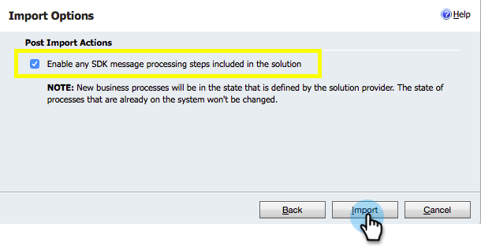

# Paso 1 de 3

<!--Install Marketo for Dynamics 2015 On-Prem and 2016 365 On-Prem Step 1 of 3-->

Antes de sincronizar In situ Microsoft Dynamics 2015 o 2016 (Dynamics 365) con Marketing, primero debe instalar la solución de Marketing en Dynamics.

>[!NOTE]
>
>Una vez que haya sincronizado Marketing con una CRM, no podrá sincronizar una nueva CRM con la instancia de Marketing existente.

>[!PREREQUISITES]
>
>Si utiliza Microsoft Dynamics On-Premise, debe tener configurada la implementación [de](http://www.microsoft.com/en-us/download/confirmation.aspx?id=41701) Internet Facing (IFD) con Servicios [de federación de](https://msdn.microsoft.com/en-us/library/bb897402.aspx) Active Directory 2.0+ (ADFS). Nota: El documento IFD se descarga automáticamente al hacer clic en el vínculo.
>
>[Descargue la solución](../../../../../product-docs/crm-sync/microsoft-dynamics-sync/sync-setup/download-the-marketo-lead-management-solution.md) de administración de posibles clientes de Marketing to antes de realizar el inicio.

>[!NOTE]
>
>**Se requieren permisos de administrador de Dynamics.**
>
>Necesita privilegios de administrador de CRM para realizar esta sincronización.

1. Inicie sesión en **Dynamics.** Haga clic en el menú desplegable **Microsoft Dynamics CRM** y seleccione **Configuración**.

   

1. En **Configuración**, seleccione **Soluciones**.

   

1. Haga clic en **Importar**.

   

1. Haga clic en **Examinar** y seleccione la solución que [descargó](../../../../../product-docs/crm-sync/microsoft-dynamics-sync/sync-setup/download-the-marketo-lead-management-solution.md). Haga clic en **Siguiente**.

   

1. Vista de la información de la solución y haga clic en **Vista de los detalles** del paquete de la solución.

   

1. Cuando haya terminado de comprobar todos los detalles, haga clic en **Cerrar**.

   

1. Vuelva a la página Información de la solución y haga clic en **Siguiente**.

   

1. Asegúrese de que la casilla de verificación de la opción SDK está seleccionada. Haga clic en **Importar**.

   

1. Espere a que finalice la importación.

   >[!TIP]
   >
   >Deberá activar las ventanas emergentes en el navegador para completar el proceso de instalación.

   

1. Descargue un archivo de registro (si lo desea) y haga clic en **Cerrar**.

   >[!NOTE]
   >
   >Puede que vea un mensaje que dice &quot;Administración de posibles clientes con marketing completada con una advertencia&quot;. Esto es totalmente esperado.

   

1. La Administración de posibles clientes de Marketing Cloud ahora aparecerá en la página **Todas las soluciones** .

   

1. Seleccione la solución de marketing y haga clic en **Publicar todas las personalizaciones**.

   

   ¡Los cinco mejores! La instalación ha finalizado.

   >[!CAUTION]
   >
   >Si se deshabilita cualquiera de los procesos de mensajería de Marketing para SDK, se producirá una instalación dañada.

   >[!NOTE]
   >
   >**Artículos relacionados**
   >
   >
   >[Instalación de Marketing para Dynamics 2015 On-Prem y 2016 365 On-Prem Paso 2 de 3](step-2-of-3-set-up.md)
